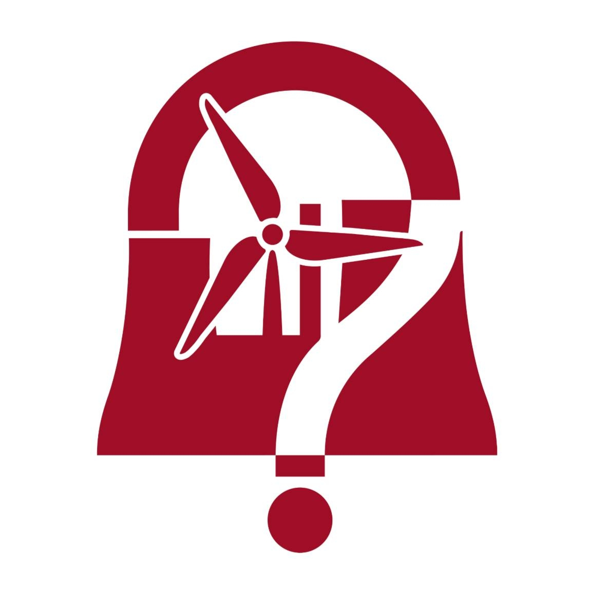
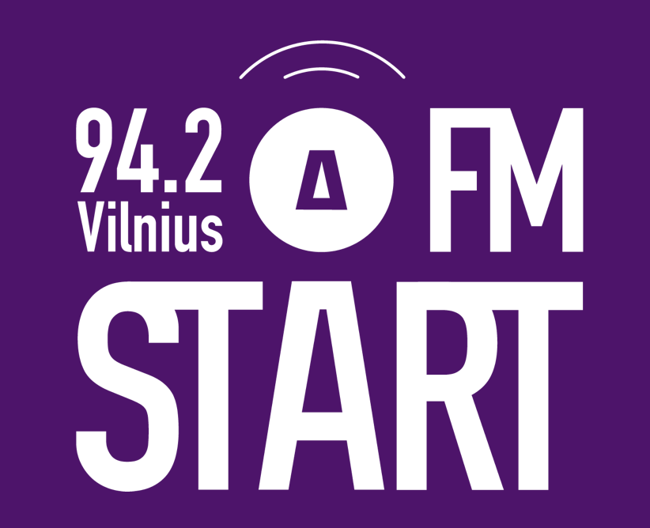

# Iniciatyvos

## Jaunųjų energetikų klubas (VU JEK)

{width=300}

<!-- SECTION:jek1:START -->

*Vadovas – Rokas Pietaris.*

Per 2024/2025 mokslo metus **Jaunųjų Energetikų
klubas** suorganizavo 4 ekskursijas (į Solitek gamyklą, Kruonio
Hidroakumuliacinę jėgainę, Vilniaus Kogeneracinę jėgainę ir ORLEN naftos
perdirbimo gamyklą), surengė 4 paskaitas (apie energetikos rinkos
liberalizaciją, EPSO-G planus po sinchronizacijos, COP 29 ir „MT Group"
kompanijos veiklą). 

<!-- SECTION:jek1:END -->
<!-- SECTION:jek2:START -->

Be to, buvo surengti 2 energetikos temos protmūšiai
(bendradarbiaujant su „Erasmus Student Network" ir Energetikos dienos
proga moksleiviams). Apsilankyta EPSO-G dešimtmečio plano pristatyme bei
konferencijose „Baltic Energy Forum" ir „LitRES". Taip pat vyko
šventinis vakaras, skirtas atšvęsti Baltijos šalių sinchronizaciją su
Europos kontininentinu tinklu. Kovo mėnesį minėta Žemės diena --
Vilniaus universitete Saulėtekyje surengta „Loretos diena." Renginio
metu studentai (-ės) galėjo pasidaryti vazonėlius iš molio, pasisodinti
augaliuką, paklausyti diskusijos apie tai, ką Vilniuj reiškia būti
„Europos žaliąja sostine", bei pamatyti filmą apie sprendimus, skirtus
planetos klimato kaitos problematikai. 

<!-- SECTION:jek2:END -->

## START FM

{width=300}

<!-- SECTION:startfm1:START -->

*Vadovas – Loranas Vaitkus*

**VU radijas START FM** – VU SA ir Vilniaus universiteto radijo stotis,
veiklą pradėjusi 2005-ais metais ir girdima 94,2 MHz FM dažniu Vilniuje
bei internetu visame pasaulyje. 
<!-- SECTION:startfm1:END -->

<!-- SECTION:startfm2:START -->

Vienintelė Lietuvoje studentų (-čių)
radijo stotis suteikia plačias saviraiškos galimybes studentams (-ėms):
padeda rengti būsimus (-as) žurnalistus (-es), programuotojus (-as) ir
kitų sričių specialistus (-es). START FM taip pat aktyviai palaiko
alternatyvių Lietuvos ir užsienio atlikėjų ir muzikos grupių kūrybos
sklaidą, rengia interviu su muzikos atlikėjais (-omis), palaiko įvairias
menines bei socialines iniciatyvas. Radijo programa yra skirta Vilniaus
miesto ir Lietuvos universitetų bei mokyklų akademinės bendruomenės
nariams, jaunimui bei visiems muzikinį smalsumą turintiems šalies
gyventojams. 

Pagrindinės START FM vertybės – kūrybiškumo ugdymas,
bendruomeniškumas ir alternatyvus požiūris į muziką bei meną.

START FM transliuojamos laidos yra inicijuojamos ir įgyvendinamos
bendruomenės narių – Vilniaus universiteto ir kitų Lietuvos aukštųjų
mokyklų studentų (-čių), absolventų (-čių), dėstytojų, ir atspindi
akademinės bendruomenės bei jaunimo gyvenimo aktualijas. Stoties
visuomeninę reikšmę sustiprina tai, kad radijas START FM visada
stengiasi padėti socialinių iniciatyvų kūrėjams (-oms), suteikdamas
galimybę informuoti visuomenę apie jų vykdomas veiklas ir akcijas.

Ataskaitiniu laikotarpiu buvo rengtos ir transliuotos kultūrinio,
šviečiamojo, informacinio pobūdžio laidos, sudarytos sąlygos VU
žurnalistikos studijų programos studentams (-ėms) įgyti praktinių žinių
ir įgūdžių. Per šį laikotarpį laidose svečiavosi gausus būrys socialiai
aktyvių pašnekovų (-ių).

<!-- SECTION:startfm2:END -->

## Kendo klubas

{width=300}

<!-- SECTION:kendo1:START -->

*Vadovas – Vytenis Almonaitis.*

**Vilniaus universiteto Studentų atstovybės Kendo klubas (VUKK)** įkurtas
2008, siekiant platinti žinias apie kendo (japoniškas fechtavimas)
studentų (-čių) tarpe ir Vilniaus Universiteto bendruomenėje. 

Šiuo metu klubui vadovauja Vytenis Almonaitis (VU Medicinos fakultetas). VU Kendo klubą sudaro 20 narių.

<!-- SECTION:kendo1:END -->
<!-- SECTION:kendo2:START -->

Pagrindiniai klubo tikslai yra: suburti Vilniaus Universiteto studentus
(-es) ir alumni, besidominčius (-čias) šia kovos menų šaka, garsinti
Vilniaus Universitetą Lietuvoje ir užsienyje dalyvaujant varžybose ir
kituose renginiuose.

Svarbiausi pasiekimai:

- (2024.07.04) Kartu su Lietuvos nacionaline kendo rinktine dalyvauta
Pasaulio Kendo Čempionate Milane. Pirmą kartą Lietuvos kendo istorijoje
vyrų komanda pateko tarp „Best 16" komandų, individualiose kovose pavyko
įveikti atkrintamasias varžybas.
- (2024.08.26) Įvyko bendra treniruotė su svečiais iš Belgijos Botokukan
kendo klubo ir Europos Kendo Federacijos sekretoriumi Pekka Nurminen.
- (2024.09.21) Suorganizuotas kendo naujokų kursas.
- (2024.10.23) Dalyvauta tarptautiniame kendo turnyre „ToruGiga" Prahoje.
- (2024.10.29) Dalyvauta praktiniame kendo seminare Kaune.
- (2024.11.04) Klubo kolega Danas Buožius Helsikyje išlaikė 3 Dan kendo meistriškumo egzaminą.
- (2024.11.16) Dalyvauta tarptautiniame kendo seminare Vroclave.
- (2024.12.01) Vilniuje vyko XV-tasis Lietuvos kendo čempionatas. Klubo
narių pasiekimai:
  - Darija Litvinenko – pirma vieta KYU individualiose kovose.
  - Raminta Girdzijauskaitė – antra vieta moterų individualiose kovose.
  - Urtė Agata Mikalauskaitė – trečia vieta moterų individualiose kovose.
  - Marius Tomaševičius – trečia vieta vyrų individualiose kovose.
- (2024.12.09) Ąžuolas Karpavičius, parvežė apdovanojimą iš jaunimo varžybų
Lenkijoje! Wroclawe Ąžuolas dalyvavo tarptautiniame kendo turnyre Dragon
Cup. Vaikinas komandinėje mišrioje trejetų rungtyje iškovojo trečią
vietą
- (2024.12.21) VU Saulėtekio centre surengtas klubo "Vilnius University
Christmas Invitational 2024" šventinis kendo turnyras.
- (2025.02.08) Surengtas pavasario kursą kendo naujokams
- (2025.02.16) Dalyvauta Vilniuje vykusiame tarptautinio kendo turnyre „Iron
Wolf Cup". 2025.03.13 Ramintą Girdzijauskaitę išlydėta į Japoniją.
Raminta dalyvavo savaitės trukmės Chiboje vyksiančiame „International
kendo leaders seminar 2025\". Į šį metinį kendo seminarą-stovyklą
kviečiami po 1-2 atstovus (-es) iš Tarptautinés Kendo Federacijos nario
-- šalies. Šiais metais stovykloje Lietuvą atstovo Vilniaus Universiteto
Kendo Klubo narė Raminta.
- (2025.03.30) Paskutinį kovo savaitgalį Vilniuje vyko iaido seminaras ir
atestacijos, kuriam vadovavo svečias iš Belgijos - Guy Loncelle (6 Dan
iaido, renshi).
- (2025.04.12) VU Saulėtekio sporto organizavome pažintinę iaido treniruotę.
Renginį vedė iaido meistrai:
  - Kotryna Patamsytė - Adomonienė (VU Kendo Klubas, 3 Dan iaido)
  - Aurelijus Motiejūnas (Lietuvos Kariuomenės Kendo Klubas, 3 Dan iaido)

**Nuorodos:**
- [Facebook](https://www.facebook.com/profile.php?id=100057509347794)
- [vukk.lt](https://vukk.lt/)
- [vusa.lt/lt/kontaktai/kendo-klubas](https://www.vusa.lt/lt/kontaktai/kendo-klubas)

<!-- SECTION:kendo2:END -->

## Karjeros dienos (VU KD)

{width=250}

<!-- SECTION:kd1:START -->

*Vadovė – Agnė Dirmantaitė*

**Vilniaus universiteto Karjeros dienos (VU KD)** – didžiausias VU SA
projektas, skaičiuojantis jau 20 veiklos metų. 

Projekto tikslas --
padėti studentams (-ėms) susipažinti su potencialiais (-iomis)
darbdaviais (-ėmis), užmegzti naujus ryšius ir savarankiškai pradėti
karjeros kelią. Projektu siekiama padėti studijuojantiesiems (-čiosioms)
įsitvirtinti darbo rinkoje ir tapti paklausiais (-iomis) savo srities
specialistais (-ėmis).

<!-- SECTION:kd1:END -->
<!-- SECTION:kd2:START -->

Jubiliejiniais veiklos metais projektas kvietė dalyvauti įvairiuose
renginiuose, diskutuoti aktualiomis temomis (užsienio studentų (-čių)
darbo paieška, dirbtinio intelekto taikymas profesinėje erdvėje,
karjeros kelio keitimo galimybės). Šiais metais suorganizuotos CV bei
LinkedIn dirbtuvės Šiaulių ir Kauno fakultetų studentams (-ėms).

Balandžio 7-11 dienomis vyko pagrindinės savaitės renginiai, kurie
Saulėtekio erdves pavertė tikru karjeros paieškų centru. Dvi dienas
vykusioje Kontaktų mugėje dalyvavo daugiau kaip 80 įmonių bei
organizacijų, su kuriomis bendravo apie 7000 studentų (-čių) iš įvairių
fakultetų. Įvyko daugiau kaip 60 Greitųjų darbo pokalbių, kurių metu
dalyviai turėjo galimybę išbandyti savo jėgas darbo pokalbių
simuliacijose. Visą parą trukusiame hakatone, organizuotame kartu su SEB
banku, dalyvavo 8 komandos, iš kurių 3 pasidalino 1000 eurų prizinį
fondą savo idėjoms vystyti. Savaitė pasibaigė Menų fabrike LOFTAS, kur
daugiau kaip 500 jaunų žmonių šėlo nemokamame koncerte.

<!-- SECTION:kd2:END -->

## VU Debatų klubas (VU KD)

{width=250}

<!-- SECTION:debatuklubas1:START -->

*Vadovė – Paulina Šalkauskaitė*

**VU Debatų klubas** – 2004 m. įkurtas klubas, skirtas skirtingų fakultetų
studentų (-čių) bendravimo skatinimui, suteikiantis erdvę kritinio
mąstymo, argumentavimo, anglų kalbos ir viešojo kalbėjimo įgūdžių
lavinimui bei atstovaujantis Vilniaus universitetui debatų turnyruose.

<!-- SECTION:debatuklubas1:END -->
<!-- SECTION:debatuklubas2:START -->

<!-- SECTION:debatuklubas2:END -->

## Be etikečių

{width=250}

<!-- SECTION:beetikeciu1:START -->

*Vadovė – Enrika Gurevičiūtė*

**„Be etikečių"** – nuo 2010 m. VU SA vykdoma programa, aktyviai veikianti
socialinės atskirties mažinimo ir žmogaus teisių srityse. 

Programos tikslas – paneigti visuomenėje nusistovėjusius stereotipus, skatinti
visapusę socialiai pažeidžiamų grupių integraciją bei kurti pagarbų
tarpusavio santykį Vilniaus universiteto bendruomenėje. Pagrindinės
vertybės – lygybė, atvirumas ir pagarba kiekvieno žmogaus
individualumui.

<!-- SECTION:beetikeciu1:END -->
<!-- SECTION:beetikeciu2:START -->

2024-2025 metais „Be etikečių ketvirtą kartą suorganizavo LGBTQ+
bendruomenei burti skirtą festivalį „Kultūra visų", kuriame teko proga
susipažinti su nuostabiais fotografais (-ėmis), rašytojais (-jomis) bei
atlikėjais (-jomis). Per mokslo metus buvo susitelkta į renginių ir
informacijos plėtrą emocinės gerovės ir lytiškumo temomis. Didesnis
dėmesys buvo skirtas diskusijoms bei dirbtuvėms paminėtomis temomis.

<!-- SECTION:beetikeciu2:END -->

## VU Studentų Investicinis fondas (VU SIF)

{width=250}

<!-- SECTION:sif1:START -->

*Vadovas – Elijas Bačiauskas*

**Vilniaus universiteto Studentų investicinis fondas (VU SIF)** savo veikla
stengiasi prisidėti prie visuomenės finansinio raštingumo ugdymo, o savo
nariams (-ėms) suteikti visapusiškas žinias bei patirtį investicijų
valdymo, finansų, marketingo bei komunikacijos srityse.

<!-- SECTION:sif1:END -->
<!-- SECTION:sif2:START -->

Svarbiausios veiklos:

- Dalyvauta Harvardo konkurse, kuriame savo investicinėmis žiniomis
varžytasi su kitų universitetų komandomis iš viso pasaulio.
- Tris mėnesius iš eilės SIF investiciniai rezultatai lenkė rinkos
vidurkį ir didžiuosius pasaulio fondus, nes investicinio komiteto
komanda sėkmingai identifikavo Europos gynybos pramonės augimą ir
sugebėjo tai išnaudoti.
- Užtikrintai augta socialinių tinklų platformose, kuriami vaizdo įrašai
apie finansinį raštingumą rinko iki 30 000 peržiūrų. Bendrai visose
socialinių tinklų platformose per metus sugeneruota beveik ketvirtį
milijono peržiūrų.
- Organizuoti įvairūs renginiai apie investavimą, akcijų rinkas,
mokesčius ir kitas verslo praktikas, kurie pritraukdavo iki 100 dalyvių.
- Keliauta po Lietuvą vedant pamokas moksleiviams (-ėms), dalyvaujant
karjeros festivaliuose, pirmakursių stovyklose ir kituose renginiuose
advokatuojant už idėjas, kad investavimas yra prieinamas kiekvienam
(-ai).
- Tęsiamas bendrandarbiavimas su ilgalaikiais partneriais – žurnalui
„Investuok" rašyti straipsnius apie Europos akcijų rinką, su Lietuvos
banku bei Verslo mokykla organizuoti Investavimo savaitės renginiai.
- Užmegztos ir naujas partnerystės – pradėta bendradarbiauti su
kolegomis iš užsienio – Lenkijos „HOSSA" ir Estijos „TalTech
Tudengifond" studentų (-čių) fondais, kurie VU SIF išskyrė kaip regiono
lyderius. Su jų pagalba 2025 metais Vilniuje įvyks tarptautinė
investavimo konferencija. Taip pat organizuoti renginiai su EVAF
Merkurijaus dienų komanda, rengti nauji projektai su LR Finansų
ministerija, LR Ekonomikos ir inovacijų ministerija bei Sodra.
- Organizuota mentorystės programa, kurios metu studentai (-ės) pusmetį
bendravo su pasirinktais fondo alumni, dirbančiais (-iomis) pasaulinėse
įmonėse. Mentoriai (-ės) dalinosi savo žiniomis, supažindino su savo
darbovietėmis bei perdavė sukauptą patirtį mentorystės programos
dalyviams (-ėms).
- Suformuota nauja VU SIF kadencija. Naujoji komanda susipažino,
pasiskirstė atsakomybėmis ir išsikėlė aiškius tikslus. Siekiant
užtikrinti efektyvų komandinį darbą, buvo organizuotos komandos
stiprinimo veiklos. Jos prisidėjo prie pozityvios atmosferos kūrimo,
sustiprino tarpusavio ryšius ir padėjo suformuoti komandą, pasirengusią
kryptingai dirbti likusį laikotarpį.

Nuorodos:

- [LinkedIn](https://www.linkedin.com/company/vusif/)
- [Facebook](https://www.facebook.com/vusif)
- [Instagram](https://www.instagram.com/vu_sif/)
- [TikTok](https://www.tiktok.com/@vu_sif)
- [Puslapis](https://vusif.lt/)
- Paštas: [direktorius@vusif.lt](mailto:direktorius@vusif.lt)
- Vadovo tel. nr. [+370 6 215 6630](tel:+37062156630)

<!-- SECTION:sif2:END -->

## ESN Vilnius University

{width=250}

*Vadovė - Lėja Ažukaitė*

<!-- SECTION:esn1:START -->

**ESN Vilnius University** – VU SA programa, skatinanti studentų (-čių) mobilumą bei padedanti užsienio
studentams (-ėms) sėkmingai integruotis į VU bendruomenę. Pagrindinis
tikslas – padėti atvykusiems (-ioms) mainų studentams (-ėms)
prisitaikyti prie naujos aplinkos, supažindinti juos su Lietuvos kultūra
ir tradicijomis, atsakyti į iškilusius klausimus bei skatinti vietinių
studentų (-čių) tarptautiškumą. 

<!-- SECTION:esn1:END -->
<!-- SECTION:esn2:START -->

Šiais metais ESN Vilnius University
pasižymėjo aktyvia veikla tiek vietiniu, tiek tarptautiniu mastu.
Surengta daugiau nei 115 renginių, skirtų visai Vilniaus universiteto
bendruomenei. Šie įtraukiantys renginiai ne tik skatino giliau pažinti
lietuvišką kultūrą – jos papročius, kalbą, virtuvę ir šventes – bet ir
prisidėjo prie tarpkultūrinio dialogo skatinimo. Jie turėjo reikšmingą
socialinį poveikį vietos bendruomenei, skatindami atvirumą, empatiją bei
solidarumą tarp skirtingų kultūrų atstovų. Šios iniciatyvos paskatino
užsienio studentus (-es) jaustis laukiamais (-omis) ir vertinamais
(-omis), o vietiniai (-ės) studentai (-ės) praplėtė akiratį ir ugdė
tarptautinį sąmoningumą. Tai kūrė tvirtus, ilgalaikius ryšius tarp
studentų (-čių) iš įvairių pasaulio šalių ir stiprino Vilniaus
universiteto, kaip atviros, daugiakultūrės bendruomenės, įvaizdį.
Didelio dėmesio sulaukė ir „ESNbuddy" programa, kurios dėka mainų
studentai (-ės) galėjo susipažinti su mentoriais (-ėmis) – savanoriais
(-ėmis), padėjusiais (-omis) susiorientuoti naujoje aplinkoje,
atsakiusiais (-ioms) į visus rūpimus klausimus ir neretai tapusiais
(-iomis) gerais (-omis) draugais (-ėmis). Taip pat sėkmingai
įgyvendintas ES projektas „Equal Voices: Gender Camp and School Action",
kuris tarptautiniu lygiu pelnė pirmąją vietą ESN Awards apdovanojimuose
socialinio poveikio kategorijoje. Šiuo projektu siekta suburti vietinius
(-es) ir užsienio studentus (-es) bendram tikslui – skatinti lyčių
lygybės suvokimą Lietuvos mokyklose, skatinant bendradarbiavimą,
dalijimąsi patirtimi ir ilgalaikių vertybių kūrimą. Taip pat atstovautas
tiek universitetas, tiek organizacija tarptautiniu mastu, dalyvaujant
tokiose svarbiose konferencijose kaip „Erasmus Generation Meeting Ancona
2025" – didžiausia studentų (-čių) organizuojama konferencija Europoje,
ir „Northern European Platform Tallinn 2024". Dėka nuoširdaus savanorių
darbo bei jų atsidavimo, sulaukta daug šiltų atsiliepimų iš tarptautinių
studentų (-čių), kurie (-ios) dėkojo už suteiktas galimybes susirasti
draugų (-ių), pažinti Lietuvą kitaip ir pasijusti Vilniaus universiteto
bendruomenės dalimi. 

<!-- SECTION:esn2:END -->

## VU Teisės klinika

{width=250}

<!-- SECTION:vutk1:START -->

*Ataskaitiniu laikotarpiu projektą iki 2025-04-08 koordinavo Karina Sinkevičiūtė, o nuo 2025-04-09 – Airina Mikulėnaitė*

**VšĮ Vilniaus universiteto Teisės klinika (VU TK)** – nemokamos teisinės
pagalbos projektas, kuris suteikia tikros profesinės praktikos galimybę
vyresniųjų kursų teisės studentams (-ėms), o visuomenei siūlo nemokamą
teisinę pagalbą ir skatina teisinį raštingumą. 

Prieš 26 m. VU TK įsteigė
ir iki šiol ją globoja VU SA, Vilniaus universitetas ir advokatų kontora
Ellex Valiūnas.

<!-- SECTION:vutk1:END -->
<!-- SECTION:vutk2:START -->

2024 m. teisinę pagalbą organizacija suteikė 6 998 gyventojams (-oms).
Remiantis interesantų (-čių) atgaliniu ryšiu apie organizacijos veiklos
kokybę galima daryti išvadą, kad VU TK užtikrina pakankamai aukštą
kompetencijos lygį ir gerą aptarnavimo kultūrą. 2024 m. sėkmingai
vykdytos konsultacijos gyvai, telefonu, elektroniniu paštu.

Ataskaitiniu laikotarpiu VU TK privalomąją profesinę arba savanorišką
praktiką, kurios trukmė 6 mėn., atliko 21 Vilniaus universiteto
studentai (-ės). Praktikos metu studentai (-ės) konsultavo interesantus
(-es) šeimos, paveldėjimo, darbo, intelektinės nuosavybės, sutarčių,
nekilnojamojo turto, vartotojų, administracinės, baudžiamosios teisės
klausimais. Taip pat rengė sutarčių projektus, procesinių dokumentų
projektus teisminėms institucijoms (teismams, darbo ginčų komisijoms),
teisines išvadas.

VU TK aktyviai bendradarbiavo su visuomenės informavimo priemonėmis,
reguliariai teikė teisinius komentarus populiariausiems portalams.

<!-- SECTION:vutk2:END -->

## The COINS konferencija

{width=250}

<!-- SECTION:thecoins1:START -->

*Vadovė – Aistė Židonytė*

**„The COINS"**  -- viena didžiausių Europoje studentų (čių) iniciatyva
organizuojamų tarptautinių konferencijų, skirtų gyvybės mokslams. 

Šis
mokslinis renginys skatina studentų (-čių) domėjimąsi naujausiais mokslo
pasiekimais, aktyvų įsitraukimą į tyrimus bei stiprina akademinius ir
profesinius ryšius. Kiekvienais metais konferencija suburia pasaulinio
lygio mokslininkus (-es), kurie (-ios) dalijasi žiniomis mūsų
universiteto bendruomenėje, taip prisidėdami prie jo tarptautinio
matomumo akademinėje erdvėje.

<!-- SECTION:thecoins1:END -->
<!-- SECTION:thecoins2:START -->

„The COINS 2025" – jau 19-tą kartą vykusi konferencija, šiemet
pritraukusi beveik 1000 dalyvių. Mokslinius pranešimus skaitė pasaulinio
lygio mokslininkai (-ės): 2024 m. Medicinos Nobelio premijos laureatas
prof. Victor Ambros, Max Planck instituto infekcinės biologijos skyriaus
įkūrėjas prof. Stefan H. E. Kaufmann, 2003 m. Ig Nobelio premijos
laureatas Kees Moeliker, žurnalo *Nature* kūrybinė direktorė Kelly
Krause ir kiti (-os) žymūs (-ios) ekspertai (-ės).

Konferencijoje su moksliniais pranešimais dalyvavo daugiau nei 200
studentų (-čių) iš VU, VGTU, LSMU, KTU bei universitetų Latvijoje ir
Lenkijoje. Jų darbus vertino per 150 mokslininkų (-ių) iš Lietuvos,
Latvijos, Lenkijos ir Jungtinės Karalystės. Lyginant su 2024 ir 2023
metais, tarptautinių dalyvių skaičius išaugo beveik keturis kartus.
Greta pagrindinės programos įgyvendintos ir specializuotos iniciatyvos,
skirtos visuomenei bei moksleiviams (-ėms) – jos prisidėjo prie
platesnio gyvybės mokslų pažinimo ir sklaidos.

<!-- SECTION:thecoins2:END -->

## Jaunųjų žurnalistų draugija

{width=250}

<!-- SECTION:jzk1:START -->

*Vadovė – Goda Ponomariovaitė*

**Vilniaus universiteto Jaunųjų žurnalistų draugija (VU JŽD)** – tai 2021
m. įkurta iniciatyva, vienijanti žurnalistika besidominčius (-ias)
moksleivius (-es) ir studentus (-es). Draugijos tikslas – burti aktyvią
ir demokratinius idealus puoselėjančių jaunų žmonių bendruomenę
Lietuvoje.

<!-- SECTION:jzk1:END -->
<!-- SECTION:jzk2:START -->

2024--2025 m. laikotarpiu VU JŽD bendruomenė išliko itin aktyvi ir
produktyvi. Vien per šiuos metus draugijos nariai (-ės) žiniasklaidoje
publikavo apie 30 žurnalistinių kūrinių, kurie pasirodė portaluose
„15min.lt" ir „bernardinai.lt".

Rugsėjį jau trečius metus iš eilės vyko Romo Sakadolskio tarptautinis
žurnalistikos forumas, kurio metu buvo įteiktos Jaunųjų žurnalistų
premijos – penkiems autoriams už išskirtinius žurnalistinius darbus
įvairiose raiškos kategorijose. Šie metai ypatingi – darbus premijai
galėjo teikti ne tik jaunieji (-osios) žurnalistai (-ės), studentai
(-ės), bet ir moksleiviai (-ės).

Be to, trečią kartą įgyvendinta Mentorystės programa, kurioje dalyvavo
net 23 mentoriai (-ės) iš įvairių žiniasklaidos priemonių. Jie (-os)
dalinosi žiniomis ir patirtimi su 24 studentais (-ėmis), siekiančiais
(-iomis) gilinti savo profesinius įgūdžius.

Draugija taip pat organizavo įvairius renginius, padedančius plėsti
akiratį ir gilinti supratimą apie šiuolaikinę žiniasklaidą. Vienas iš jų
-- susitikimas su JAV ambasados Lietuvoje atstovais (-ėmis), kuris buvo
skirtas paminėti Žmogaus teisių dieną ir aptarti žurnalistų vaidmenį
šiuolaikinėje visuomenėje. Taip pat vyko susitikimas su Europos
migracijos tinklo (EMN) atstovais (-ėmis), kuriame buvo aptariami
pasauliniai migracijos procesai ir žurnalistikos svarba, atspindint šias
temas.

Artimiausiu metu prasidės Žurnalistų dienos (leŽuDi) – tradicinis VU
JŽD renginys, organizuojamas Draugijos narių. Savaitę truksiančioje
programoje numatyti įvairūs renginiai: protmūšis, diskusijos, filmų
peržiūros, sporto varžybos ir šventinis uždarymo vakaras.

Nors metai buvo kupini iššūkių, tačiau kartu tai leido Draugijos nariams
(-ėms) išbandyti ir atrasti savo stipriąsias puses. Tikime, kad ir
toliau Draugija klestės ir garsins savo vardą net ir už Vilniaus
universiteto ribų.

<!-- SECTION:jzk2:END -->

## HEMA kovos menų klubas

{width=250}

<!-- SECTION:hema1:START -->

*Vadovė – Gintarė Vaičekauskytė*

Alber aus VU HEMA klubas – istorinių Europos kovos menų klubas, kuriame
treniruojamasi ilgaisiais kalavijais.
<!-- SECTION:hema1:END -->
<!-- SECTION:hema2:START -->
Hemos klubas dalyvavo įvairiuose turnyruose, šventėse ir mugėse --
Viduramžių dienoje, SMK studentų (-čių) naktyse , gyvosios archeologijos
dienose Kernavėje XXIII.

Taip pat surengtas turnyras Valentino dienos proga su įdomiomis
paskaitomis. Nariai (-ės) dalyvavo ne viename tarptautiniame turnyre
skirtinguose Europos miestuose. Taip pat pristatyta vykdoma veikla
įvairiuose populiariuose renginiuose – Comic con, Lituanicon bei Winter
con. Šiuo metu planuojamas trečiasis oficialus turnyras birželio 14
dieną, kuris bus taip pat atviras ir visuomenei. HEMA klubas džiaugiasi
savo nariais (-ėmis), kurių tobulėjimą mato dėl didėjančio
profesionalumo, stipraus atsidavimo šiai kovos menų sričiai vis aktyviau
dalyvaujant tarptautinėje Hemos turnyrų scenoje.
<!-- SECTION:hema2:END -->

## Tvarumo ambasadorių tinklas

{width=250}

<!-- SECTION:tat1:START -->

*Vadovė – Toma Vilkaitė*

Tvarumo Ambasadorių tinklas (TAT) yra VU SA programa, siekianti šviesti
Vilniaus Universiteto bendruomenę ir visuomenę apie tvarumą, jo principų
taikymą savo kasdienybėje, taip prisidedant prie tvaresnės ateities.

2024-2025 akademiniai metai programai buvo pirmieji veikiant reguliariai
VU SA struktūroje.

<!-- SECTION:tat1:END -->
<!-- SECTION:tat2:START -->

Ataskaitiniu laikotarpiu vyko du visuotiniai susirinkimai, kviestinio
lektoriaus pranešimas ir keletas renginių bendradarbiaujant su kitomis
iniciatyvomis, pvz. Debatų klubu ir Komunikacijos fakulteto studentų
(-čių) moksline draugija. Vyko ne viena edukacija mokyklose ar išorinėse
organizacijose, pristatytas tvarumas Vilniaus ir kitų miestų
moksleiviams (-ėms). Taip pat parengti pasiūlymai, kuriais būtų galima
gerinti Vilniaus Universiteto įsitraukimą į tvaresnį transportą, žaliųjų
erdvių plėtrą ir žalesnį Vilniaus Universitetą. Taip pat Vilniui tapus
Žaliąja sostine, pateiktas projektas Vilniaus miesto savivaldybei.

Įvyko Tvarumo festivalis'25, šiais metais pavadintas „Breathe in, green
out". Jo metu buvo siekiama per įvairias veiklas supažindinti dalyvius
(-es) su tvarumu ir kaip jis veikia. Šiais metais vyko diskusija, gyvoji
biblioteka, dirbtuvės, orientacinės žaidynės ir koncertas. Kviestiniai
(-ės) įmonių ir organizacijų atstovai (-ės) leido dalyviams (-ėms)
interaktyviai susipažinti su tvarumu ir gilinti žinias įvairiose tvarumo
srityse ir temose.

<!-- SECTION:tat2:END -->

## Studentai - moksleiviams, moksleiviai - studentams (SMMS)

{width=250}

<!-- SECTION:smms1:START -->

*Vadovas – Laurynas Cicėnas*

„Studentai – moksleiviams, moksleiviai – studentams\" – VU SA
organizuojama 3 dienų trukmės stovykla, skirta vyresnių klasių
moksleiviams (-ėms). Stovyklos tikslas – padėti moksleiviams (-ėms)
pasirinkti jiems (-oms) tinkamą studijų kelią, supažindinant su Vilniaus
universitetu ir jo teikiamomis galimybėmis.

<!-- SECTION:smms1:END -->
<!-- SECTION:smms2:START -->

Kovo 14-16 dienomis Vilniaus universitete vyko jau tapęs pavasario
tradicija renginys - stovykla „Studentai – moksleiviams, moksleiviai --
studentams", pritraukusi apie 70 moksleivių iš skirtingų Lietuvos
kampelių.

Renginio metu moksleiviai (-ės) susipažino su Vilniaus universitetu,
Studentų atstovybe, lavino komandinio darbo įgūdžius ir leidosi į
kelionę po VU padalinius.

O įgyti žinių apie universitetą ir studentišką gyvenimą moksleiviams
(-ėms) padėjo SMMS kuratorių komanda.

<!-- SECTION:smms2:END -->

## Rašytojų klubas

{width=250}

<!-- SECTION:rk1:START -->

*Vadovas – Rokas Bitinaitis*

Šiais mokslo metais po pertraukos Rašytojų klubas vėl susibūrė. Klubo
nariai (-ės) skaitė įvairių autorių, tarp jų ir savo, kūrybą, žaidė
rašymo žaidimus, kartu dalyvavo renginiuose, bendravo su rašytojais
(-omis), aptarinėjo savo perskaitytas knygas.

<!-- SECTION:rk1:END -->
<!-- SECTION:rk2:START -->

Dauguma užsiėmimų buvo vidiniai, tačiau vyko vieša paskaita „Nužudytųjų
poetų naktis", per kurią mūsų narys Nazar pasakojo apie daugybę
baltarusių poetų, kurie kūrė priespaudos metu ir buvo tragiškai nužudyti
valdžios. Taip pat dalyvavome ir jo kitoje paskaitoje apie šiuolaikinius
Baltarusijos politinius kalinius VU TSPMI. Skaityti ir kitų autorių
trumpos apimties kūriniai, kurie vėliau buvo aptarti jaukioje aplinkoje.

Klubo susitikimai vyksta tiek anglų, tiek lietuvių kalbomis, siekiant
įtraukti ir lietuviškai nekalbančius (-ias) Universiteto bendruomenės
narius (-es).

<!-- SECTION:rk2:END -->

## UYGL

<!-- SECTION:uygl:START -->

*Vadovė – Anna Humenna*

2024–2025 mokslo metais Ukrainos jaunimo grupė Lietuvoje (UYGL) telkė bendruomenę, skatino pilietiškumą ir palaikė Ukrainą per įvairias iniciatyvas. Rugsėjį Vilniuje surengtas labdaros bėgimas „Run for Light“ sutraukė per 100 dalyvių ir padėjo surinkti daugiau kaip 1200 € paramos Ukrainos gynėjams.
 
Pilietinio sąmoningumo klube vyko diskusijos apie istoriją, kultūrą ir medijų dekolonizaciją; į svečius pakviestas savanoris, kovojęs Ukrainoje, bei Harvardo profesorius Serhii Plokhy. Renginiai „Laisvės žodžiai“, „Už tylos ribų“ ir kovo mėnesį surengtos solidarumo eitynės subūrė šimtus žmonių priminti paramos svarbą.
 
Lapkritį UYGL kartu su VU SA TSPMI surinko ir supakavo daugiau kaip 70 kalėdinių dovanų Lietuvoje gyvenantiems Ukrainos vaikams, o gruodį, prisijungusi prie Padėkos projekto, finansavo skubiai reikalingą įrangą kariams.

<!-- SECTION:uygl:END -->

## Fotoklubas

{width=250}

<!-- SECTION:foto1:START -->

VU Fotoklubas – Vilniaus universiteto fotografus (-es) vienijantis klubas --
bendruomenė, kurią jungia aistra fotografijai ir noras šiuo menu
dalintis su kitais (-omis). Kiekvieną iššūkį klubas priima kaip galimybę
augti, tobulėti ir vėl kurti stiprią, aktyvią Vilniaus universiteto
fotografų (-ių) bendruomenę.

<!-- SECTION:foto1:END -->
<!-- SECTION:foto2:START -->

Pastaruoju metu organizuojami įvairūs renginiai ir susitikimai, kurių metu
ne tik dalinamasi fotografijos pagrindais bei praktiniais patarimais
naujai prisijungusiems (-ioms) nariams (-ėms), bet ir stengiamasi
skatinti kūrybiškumą bei gebėjimą įžvelgti grožį supančioje aplinkoje.
Šie susibūrimai tampa puikia proga ne tik mokytis, bet ir megzti ryšius
tarp bendraminčių.

Fotoklubo tikslas – suburti tvirtą, veiklią ir matomą fotografų (-ių)
bendruomenę, kurios darbai galėtų džiuginti ne tik socialinių tinklų
sekėjus, bet ir plačiau paplisti Vilniaus universiteto erdvėse --
parodose, renginiuose ar kitose viešose iniciatyvose.

<!-- SECTION:foto2:END -->

## Laisvalaikio draugija „Kauliukas"

{width=250}

<!-- SECTION:kauliukas1:START -->

*Vadovas – Robert Berlin*

Draugija organizuoja įvairius renginius (žaidimų vakarus, memų
konkursus, D&D (požemius ir drakonus)) kiekvieną savaitę, kurių tikslas
-- vienyti studentus (-es) iš skirtingų padalinių suteikiant aplinką
socializacijai be alkoholio.

<!-- SECTION:kauliukas1:END -->
<!-- SECTION:kauliukas2:START -->

**Šiuo metu draugijoje yra 256 nariai (-ės). Renginiuose žmonių kiekis
didėja, žmonės grįžta į renginius, susiformavo artima bendruomenė. Iš
viso įvyko apie 95±5 žaidimų vakarai, 5 memų konkurai, vienas protmūšis,
bei vienas D&D renginys (taip pat šiuo metu berods yra du D&D campaigns,
jie susirenka pagal savo grafiką).

<!-- SECTION:kauliukas2:END -->

## Klubas „Artì"

{width=250}

<!-- SECTION:arti1:START -->

*Vadovė – Austėja Bačiulytė*

Artì – tai dailės ir rankdarbių klubas, susikūręs 2024 metų pavasarį.
Per šiuos metus kūrėme erdvę, kurioje universiteto bendruomenės nariai
(-ės) galėtų laisvai reikštis kūrybiškai, mokytis naujų dailės ir
rankdarbių technikų.

<!-- SECTION:arti1:END -->
<!-- SECTION:arti2:START -->

Per šiuos metus įvyko dirbtuvės VU SA KF ir VU SA FsF suorganizuotame
renginyje apie Meno terapiją, VU SA CHGF renginyje, VU SA KF
suorganizuotame Advento vakare. Be bendradarbiavimo su VU SA padaliniais
ir kitomis studentiškomis iniciatyvomis, beveik kiekvieną savaitę vedėme
užsiėmimus su savo klubo nariais (-ėmis), kurių metu mokėmės įvairių
dailės bei rankdarbių technikų – piešimo su tušu, siuvinėjimo, molio
lipdymo ir kt. Orams atšilus, kartu su nariais (-ėmis) įvyko tapymo prie
sakurų veikla.

<!-- SECTION:arti2:END -->

## Studentų mokslinė draugija „(Un)discovered Asia"

{width=250}

<!-- SECTION:uasia1:START -->

*Vadovė – Vesta Šiaudvytytė*

Šie akademiniai metai „(Un)discovered Asia" klubui buvo veiklūs ir
prasmingi. Tai studentų (-čių) mokslinė draugija (SMD), kuri siekia
suburti studentus (-es) ir bendraminčius (-tes), aktyviai besidominčius
(-ias) Azijos regionu.

<!-- SECTION:uasia1:END -->
<!-- SECTION:uasia2:START -->

Pavasario semestre įvyko renginys – Azijos kalbų kavinė „K-wave & Desi
Vibes: Learning Korean and Hindi together", kuri organizuota drauge su
VU ESN. Renginys pritraukė daugybę susidomėjusiųjų hindi ir korėjiečių
kalbomis.

Šiais metais dar planuoja surengti renginį apie Indijos kultūrą su
„ARTI" meno klubu bei  sanskrito kalbos užsiėmimą per Azijos ir
transkultūrinių studijų instituto festivalį „ATSIbusk".

<!-- SECTION:uasia2:END -->

## Studentų pilietinio pasipriešinimo komitetas

{width=250}

<!-- SECTION:sppk1:START -->

*Vadovas – Gytis Oškelis*

Studentų pilietinio pasipriešinimo komiteto (SPPK) misija yra edukuoti
studentus (-es) pilietinio pasipriešinimo temomis bei didinti jų valią
gintis. SPPK – jauna iniciatyva, oficialiai įkurta 2024 m. balandį.

<!-- SECTION:sppk1:END -->
<!-- SECTION:sppk2:START -->

Per 12 mėnesių surengta 12 renginių. Diskusijose ir paskaitose gilintasi
į valstybės gynybos klausimus iš įvairių perspektyvų: lankytos vietos,
kuriose studentai (-ės) pasipriešino 1941 m. sukilimo metu, įvyko trys
visuotiniai susirinkimai, kuriuose mokyta taktinės medicinos, nagrinėta
Lietuvos kariuomenės istorija ir struktūra. Be to, surengti išgyvenimo
mokymai skirti praktiniams išgyvenimo įgūdžiams tobulinti.

Komiteto nariai aktyviai prisidėjo rengiant *„Rezoliuciją dėl VU
vaidmens ugdant bendruomenės atsparumą ir sąmoningumą nacionalinio
saugumo grėsmėms"* ir pateikė siūlymus, kad VU SA strateginiame plane
pilietiškumo/atsparumo ugdymas būtų išskirtas kaip prioritetinė kryptis.

SPPK veikia daugiau kaip dvidešimt aktyvių narių, o turinį socialiniuose
tinkluose seka \> 520 „Facebook" ir ≈ 300 „Instagram" vartotojų.

Komitetas džiaugiasi VU SA bei visais (-omis), kuriems (-ioms) jų
vykdoma veikla atrodo prasminga. Tikimasi, kad kitais ataskaitiniais
metais, VU SA skiriant dar daugiau dėmesio SPPK tematikos veikloms,
kartu bus sukurtas dar didesnis pokytis ugdant VU bendruomenės
atsparumą, sąmoningumą ir pilietinio pasipriešinimo įgūdžius.

<https://www.vusa.lt/lt/kontaktai/sppk>

<!-- SECTION:sppk2:END -->

<LightboxPictureArray :photos="sppk1" />
<LightboxPictureArray :photos="sppk2" />

<!-- SECTION:konsultavimas1:START -->

## Konsultavimas 

*Vadovė – Kamilė Valvonytė*

VU SA konsultavimas prie VU SA PKP tinklo prisijungė 2025 metais. VU SA
konsultavimo proceso tikslas – padėti studentui (-ei) išspręsti bet
kokias kylančias problemas arba nukreipti ten, kur galės padėti kiti
(-os).

VU SA konsultavimas apima platų klausimų spektrą: nuo stojimo į VU iki
nusiskundimų dėl studijų programų, stipendijų ir prisijungimo į VU SA
veiklas. Taip pat konsultuojama bendrabučių, LSP bei kitais studentams
(-ėms) aktualiais klausimais.

Nuo 2024 m. visi prisijungiantys konsultantai (-ės) turėjo išlaikyti
akademinių ir socialinių žinių testą, kad užtikrintų kokybišką, tikslią
ir atsakingą pagalbą. Testą išlaikę konsultantai (-ės) prisideda prie
nuoseklaus informacijos teikimo visos organizacijos mastu.

VU SA konsultavimo komanda aktyviai dalijosi žiniomis ir patirtimi
vidiniuose VU SA fakultetų mokymuose bei fakultetų ir visuotiniuose
susitikimuose.

VU SA konsultavimas – tai daugiau nei atsakymai į klausimus. Tai erdvė,
kuri siekia kurti palaikančią, informuotą ir stiprią universiteto
bendruomenę.

<!-- SECTION:konsultavimas1:END -->

## Nėrimo klubas

{width=250}

<!-- SECTION:nerimas1:START -->

*Vadovė – Abija Tamoševičiūtė*

Nėrimo klubas – tai VU studentų (-čių)
organizuojamas kassavaitinis užsiėmimas, kurio metu mokomasi nėrimo
amato. Klube veikia tiek VU bendruomenės nariai (-ės), tiek žmonės iš
išorės. Čia skiriamas laikas atsipalaiduoti, užsiimti šiuo ypatingu
amatu ir smagiai pabendrauti. Pagrindinis veiklos tikslas – jaukios ir
be streso atmosferos puoselėjimas, bendrystė. Vasars metu planuojama
simbolinė klubo darbų paroda. 

<!-- SECTION:nerimas1:END -->

## „Aurora" basket

{width=250}

<!-- SECTION:aurora:START -->

*Vadovas – Žygimantas Mazėtis*

„Aurora" Basket – tai krepšinio mėgėjų klubas, jungiantis krepšiniui
prijaučiančius (-ias) Vilniaus universiteto bendruomenės narius (-es).
Klubas siekia sukurti aplinką, kurioje kiekvienas (-a), nepriklausomai
nuo lygio ar sportinio pasiruošimo, galėtų gerai praleisti laiką
žaisdamas (-a) krepšinį. Tai naujai susikūrusi iniciatyva, tačiau jau
turinti reguliarų žaidimo laiką ir besikuriančią bendruomenę. Prisidėjo
prie 3x3 turnyro organizavimo, kuriame dalyvavo ne tik klubo, bet ir
visos VU bendruomenės nariai (-ės). 

<!-- SECTION:aurora:END -->

## Astronomų klubas

{width=250}

<!-- SECTION:astr:START -->

*Vadovas – Mykolas Radziukynas*

Veikla buvo pradėta šiais metais, pritraukta 20 narių ir dar
daugiau susidomėjusių. Ateinančiais metais planuojama organizuoti
struktūruotus posėdžius, giliau paliesti astronomijos temas. Taip pat
planuojamos raketų modelių varžytuvės ir festivalis, kurio metu vyktų
naktinio dangaus ir persėjidų lietaus stebėjimai.

<!-- SECTION:astr:END -->
