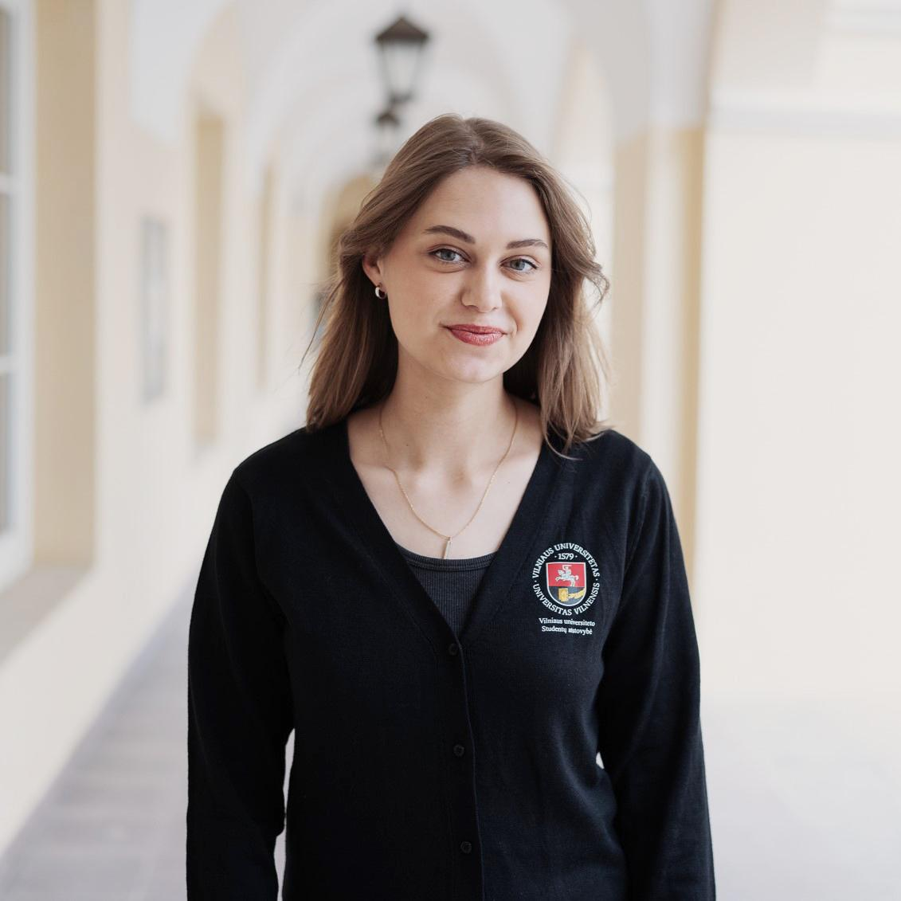

# Prezidentės kalba

<!-- SECTION:presidents-letter:START -->
Mieli studentai ir studentės, brangūs Organizacijos nariai ir narės,  
 
Šie, 35-ieji metai Atstovybei buvo kupini pokyčių. O pagrindinės šių metų veiklos kryptys ir darbai buvo apie individualiųjų studijų, iniciatyvų kūrimo ir stiprinimo, studentų ir studenčių su negalia bei atsparumo išorės grėsmėms tematikas. 
    
Aktyviai prisidėjome prie naujos Vyriausybės programos ir priemonių įgyvendinimo plano formavimo, teikėme pasiūlymus ir įsitraukėme į skirtingas darbo grupes,  studentams ir studentėms rūpimais klausimais.

Glaudžiai bendradarbiaujame su aukštojo mokslo institucijomis ties studentų ir studenčių įsitraukimu į mokslines veiklas, akademinės etikos nusižengimų prevencijos, socialinės dimensijos plėtros aukštajame moksle klausimais. Mezgėme dialogą tarptautiniame ARQUS aljanse ir keitėmės gerosiomis praktikomis su užsienio studentų ir studenčių sąjungomis. Dirbome ties Organizacijos dokumentų, Stiliaus knygos, Integracijos ir planavimų proceso atnaujinimais, įsteigėme Studentų  ir studenčių iniciatyvų centrą bei sistemingai dirbome ties Organizacijos narių kompetencijų kėlimu. 
 
Galiu užtikrintai sakyti, kad VU SA yra stipri matoma ir girdima. 
 
Žengsime į būsimus studijų metus su jau patvirtintais naujais Organizacijos strateginiais projektais, liečiančiais kiekvieną mūsų bendruomenės narį ir narę. Didžiuojuosi Organizacija, mūsų visų įsitraukimu bei stipriomis partnerystėmis.  
 
Kviečiu susipažinti su visais metuose nuveiktais darbais VU SA 2024–2025 metų ataskaitoje. Nuoširdžiai ačiū Jums už šiuos metus ir toliau dirbkime „Vieningai už studentų (-čių) ateitį! 
 
**Klėja Merčaitytė** 

VU SA Prezidentė
<!-- SECTION:presidents-letter:END --> 
