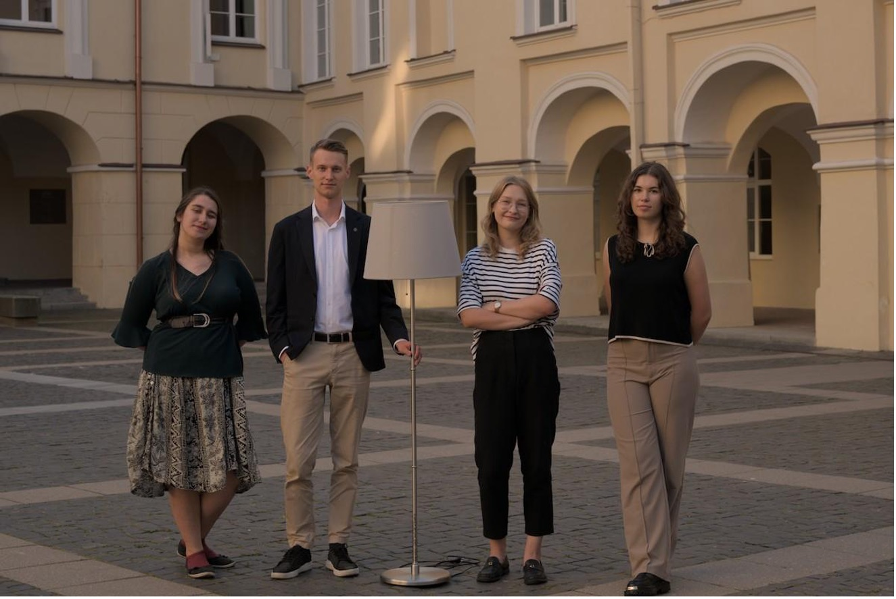
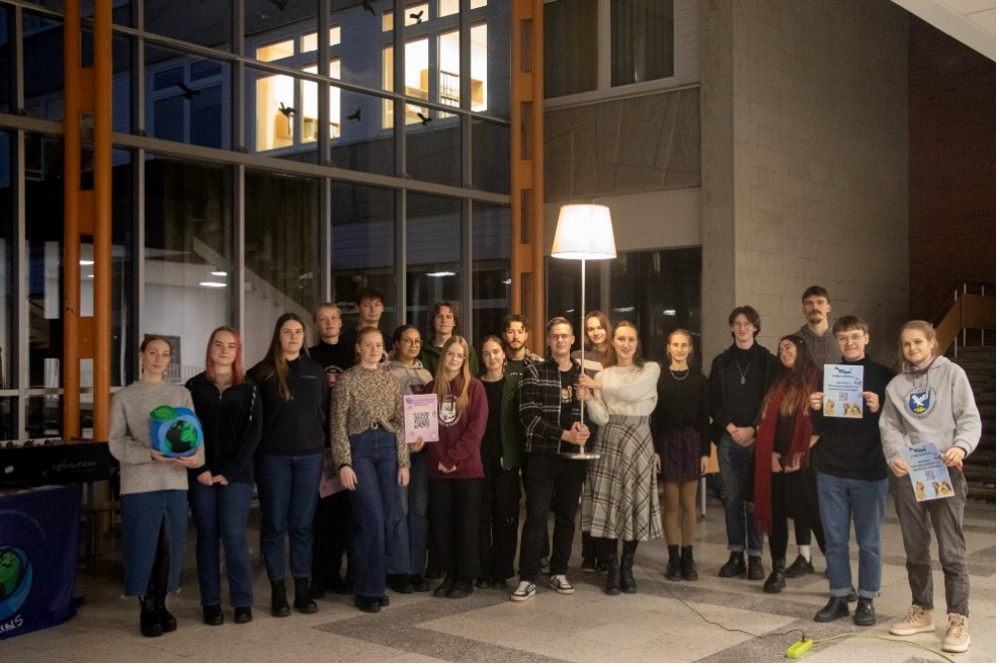
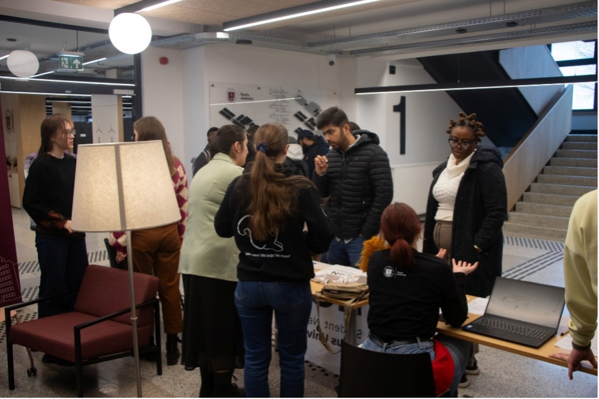
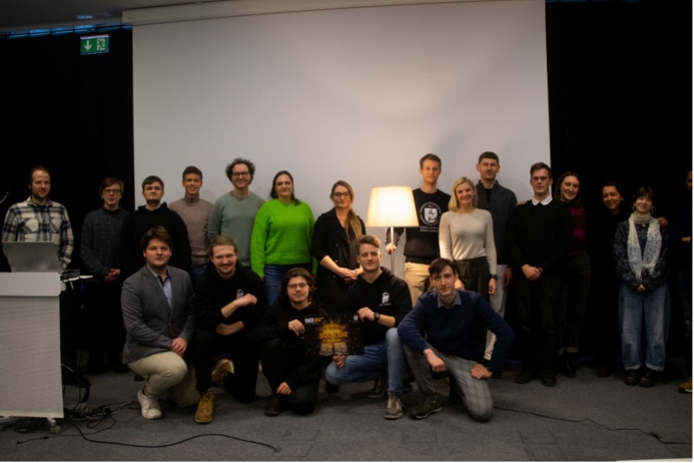

# Procesų atnaujinimas

## Integracijos procesas

2024--2025 m. laikotarpiu buvo įgyvendinti reikšmingi integracijos
proceso pokyčiai, siekiant užtikrinti kokybiškesnį pasiruošimą ir
sklandesnį naujų studentų (-čių) įsitraukimą į universiteto bendruomenę.

**Paankstinti procesai:**\
Kuratorių atranka pradėta anksčiau nei ankstesniais metais, o tai sudarė
galimybę įvesti komandos formavimo laikotarpį*.* Šis etapas skirtas
stiprinti tarpusavio bendradarbiavimą ir pasirengimą dar prieš aktyvios
kuratorių veiklos pradžią. Taip pat paankstinti centriniai kuratorių
mokymai, dėl to yra sudaromos geresnės sąlygos vykdyti ir padalinio
kuratorių mokymus. Narystės testas vis dar yra privaloma sąlyga, tačiau
nuo dabar kuratoriai (-ės) turės išlaikyti šį testą dar prieš aktyvią
veiklą.

**Tarptautinių studentų (-čių) integracija:**\
Pradėtas rengti tarptautinių studentų (-čių) integracijos planas,
siekiant tikslingiau ir sistemingiau įtraukti šią studentų (-čių) grupę.
Pastebėta, kad kuratoriams (-ėms), atliekantiems (-čioms) mentorių
funkcijas, reikalingos papildomos kompetencijos, todėl buvo priimtas
sprendimas išskirti šias dvi pareigybes – kuratorius ir mentorius tampa
skirtingomis pareigybėmis su skirtingais pasirengimo poreikiais.

**Doktorantų (-čių) mentorystė:**\
Taip pat pradėtas organizuoti doktorantūros studentų (-čių) mentorystės
procesas. Tai naujas žingsnis siekiant užtikrinti, kad ir šios studijų
pakopos studentai (-ės) turėtų prieigą prie pagalbos, orientacijos ir
bendruomeninės paramos nuo pat studijų pradžios.

## Planavimų procesas

Siekiant, kad VU SA planavimų procesas būtų sklandesnis bei įvertinus, kad ne visi (-os) Organizacijos nariai (-ės) turi vienodas žinias apie VU SA viduje vykstantį procesą buvo priimtas sprendimas planavimų procesą peržiūrėti iš naujo ir atnaujinti tam tikras proceso dalis, siekiant efektyvesnio ir aiškesnio planavimo proceso bei išsikeltų tikslų įgyvendinimo. Įgyvendinant visą planavimų atnaujinimo procesą buvo konsultuotasi su VU SA alumni, atlikti pokalbiai su VU SA P pirmininkais (-ės), Instituciniu stiprinimo fondu bei VU SA Centriniu biuru. Taip pat gruodžio mėn. buvo įgyvendinta darbinės sesija, kurios metu išgryninti pagrindiniai sprendimo būdai, kurie leistų VU SA veiklos planavimo ir įgyvendinimo procesą įgyvendinti sklandžiau.

VU SA visas planavimo procesas susideda iš keturių dalių: pasiruošimo
planavimams, planavimų įgyvendinimo, susidaryto plano įgyvendinimo bei
monitoringo proceso. Atnaujinimo metu visos pastarosios proceso dalys
buvo peržiūrėtos iš pagrindų ir atnaujintos pagal organizacijos narių
išsakytus poreikius. Pagrindiniai pokyčiai buvo šie:

- Kiekvienais metais VU SA P komandos savo padalinyje esančias problemas
turėjo išgryninti tik pasikeitus kadencijai ir tai darydavo naujoji
komanda, kuriai dažnu atveju galėjo trūkti konteksto. Siekiant, kad
problemų išgryninimas būtų kokybiškas ir atliekamas laiku, nuspręsta,
kad VU SA P komandos savo problemas grynina ir jau esamą aprašo plačiau
per kovo mėn.
- Į VU SA vasaros bei VU SA P rudens mokymus turės būti įtrauktos
veiklos, kurios buvo nukreiptos į VU SA planavimo aktualijas arba turės
būti susijusios su VU SA P probleminių sričių nagrinėjimu bei
pristatymu.
- Siekiant, kad kiekvienas VU SA P tinkamai susiplanuotų ir galėtų
matyti bendrą savo metinės veiklos planą, per VU SA P planavimus
kiekviena komanda turės privalomai užpildyti šiuos dokumentus: tikslo
įgyvendinimo planą, mokslo metų veiklos planą, mokslo metų veiklų
tinklelį.
- Atnaujintas VU SA tikslo įgyvendinimo plano šablonas.
- VU SA P komandų lūkesčių suformavimas moderatoriams (-ės), moderatorių suteikimas bei registracija į VU SA P planavimus numatyta vykdyti
ankščiau nei įprastai.
- Sukurtas VU SA planavimo vadovas, kuriame yra tiksliai ir aiškiai
aprašyti dažniausiai VU SA vykstantys planavimų tipai: VU SA ir VU SA P
planavimai, metinės veiklos planavimai, VU SA PKP planavimai bei sričių
planavimai. Pastarieji planavimo tipai buvo aprašyti remiantis
dabartiniai VU SA procesais bei pateikiant aiškius nurodymus, kaip
kiekvienas iš šių procesų vyksta bei kaip reikia jam pasiruošti.

## Kompetencijų žemėlapis

Dalyvavimas mokymuose, skirtuose nario (-ės) veiklai reikalingoms
kompetencijoms suteikti ir kelti yra Vilniaus universiteto Studentų
atstovybės narių pareiga, numatyta Organizacijos įstatuose, o
kompetencijų kėlimo nuoseklumas yra strateginis projektas, numatytas VU
SA 2022--2025 m. strateginiame veiklos plane. Siekiant įgyvendinti
Įstatuose numatytą pareigą ir Strateginiame plane numatytą prioritetą,
2024-2025 m. parengtas VU SA narių kompetencijų žemėlapis – koncepcija,
skirta užtikrinti:

- strateginį požiūrį į VU SA narių kompetencijų kėlimą;
- VU SA narystės kelio sampratą, kuri apibrėžia, kad visi (-os) nariai
  (-ės), pažindami (-os) save, atrasdami (-os) naujus interesus,
  siekdami (-os) tobulėti ir mokytis visą gyvenimą, turi lygias
  galimybes išbandyti save įvairiose Organizacijos veiklose ir jų
  įgyvendinime;
- reguliaria (savi)refleksija ir savalaikiu abipusiu grįžtamuoju ryšiu
  įgalintą asmeninį kiekvieno (-os) nario (-ės) tobulėjimą.

Kartu bus siekiama, kad šie principai taptų pagrindu VU SA vidaus
kultūros transformacijai, užtikrinant Organizacijos ekspertiškumą ir
galimybę studentams (-ėms), prisijungusiems (-ioms) prie VU SA
padalinių, programų, klubų, projektų, kitų iniciatyvų, struktūrinių
darinių, darbo ar saviraiškos grupių, realizuoti save ir tobulėti.

## SIC atsiradimas

Šiemet pradėjo veikti [VU SA Studentų iniciatyvų
centras](https://www.vusa.lt/lt/kontaktai/sic). Tai 5 žmonių komanda,
kurios tikslas sudaryti sąlygas studentams (-ėms) kurti ir vystyti
iniciatyvas visuomeninėje, mokslinėje, kultūrinėje, sportinėje ir
laisvalaikio srityse. Mūsų misija – suteikti studentams (-ėms) erdvę
kurti, augti ir bendradarbiauti, remiant veikiančias iniciatyvas,
skatinant naujų atsiradimą bei stiprinant aktyvią, kūrybišką ir
moksliškai smalsią Vilniaus universiteto bendruomenę. Kuriamos naujos
iniciatyvos, organizuojami renginiai skatinantys studentų (-čių)
įsitraukimą į bendruomenės veiklą universitete, palaikomi 28 VU SA
[programos, klubai, draugijos,
projektai](https://www.vusa.lt/lt/programos-klubai-projektai) ir kitos
studentiškos iniciatyvos.

Pirminę komandos sudėtį sudarė Domantas Klumbys, Gabija Bakutytė, Ieva
Radzevičiūtė ir Gabija Smailytė.

Kadencijos eigoje SIC komandą papildė daugiau narių: prie veiklos
prisijungė Kotryna Katinaitė ir Deivydas Mickus bei vėliau komandą
palikusios Areta Petrauskaitė ir Ernesta Onusaitytė.

Pirmieji veiklos metai buvo intensyvūs ir kupini sėkmės. Lapkričio 21
dieną SIC surengė studentų (-čių) **mokslinių iniciatyvų mugę**, kurioje
savo veiklą pristatė studentų gamtininkų mokslinė draugija (SGMD),
tarptautinių santykių ir politikos mokslų instituto SMD, (Un)discovered
Asia, komunikacijos fakulteto SMD, The COINS, Istorijos fakulteto SMD
bei psichologų studentų draugija VUpsi. Renginyje dalyviai (-ės) turėjo
galimybę susipažinti su Vilniaus universitete veikiančiomis mokslinės
tematikos saviraiškos iniciatyvomis, užduoti rūpimus klausimus ir
daugiau sužinoti apie jų vykdomą veiklą.

Įvykusi mokslinių iniciatyvų mugė pažymėjo studentų (-čių) mokslinių
iniciatyvų tinklo pradžią – po mugės suorganizuoti 2 SMD vadovų (-ių)
susitikimai, kurių metu aptarta tarpusavio bendradarbiavimo bei
tarpdiscipliniškumo svarba, plėtojamos naujų projektų idėjos.

Taip pat SIC dėmesį skyrė ir universiteto bendruomenės stiprinimui Kaune
bei Šiauliuose. 

Vasario 11 dieną, SIC komanda surengė iniciatyvų dieną
VU Šiaulių akademijoje, o kovo 25 dieną VU Kauno fakultete. Šiuose VU
padaliniuose studijuojantiems (-čioms) studentams (-ėms) buvo
pristatytos VU SA veikiančias studentiškos iniciatyvos. Dalyviai (-ės)
turėjo galimybę ne tik užduoti klausimus jau veikiančių studentiškų
iniciatyvų atstovams (-ėms), bet ir iš VU SA studentų (-čių) iniciatyvų
centro narių sužinoti, kaip patys (-čios) galėtų įkurti iniciatyvą savo
bendruomenėje.

Vasario 21 dieną SIC suorganizavo Hack'VU 25 – studentiškų iniciatyvų
hakatoną. Hakatono metu, dalyviai (-ės) kartu su veiklos moderatoriumi
Klaudijumi Meliu grynino savo iniciatyvų idėjas bei bandė išspręsti
praktinius klausimus. Vėliau turėjo galimybę kreiptis pagalbos į
mentorius (-es), kurie (-ios) dalinosi savo patirtimi ir žiniomis bei
padėjo kuriant idėjų įgyvendinimo planus. Renginyje kurtos krepšinio
klubo, gyvosios lotynų kalbos klubo, astronomų klubo bei tarptautinių
studentų (-čių) integracijos iniciatyvos iš skirtingų universiteto
padalinių. Hakatono pagrindinį prizą – 500 eurų finansavimą iniciatyvos
veikloms įgyvendinti laimėjo VU astronomų klubas iš fizikos fakulteto.

Iš viso kadencijos eigoje SIC padėjo įsikurti net penkioms naujoms
bendruomenėms: Nėrimo klubui, Rašytojų klubui, Astronomų klubui,
krepšinio klubui „Aurora Basket" bei gyvosios lotynų kalbos klubui
„Otium Palæmonis", taip pat organizuotos VU fotoklubo veiklos. Šios
naujos iniciatyvos apjungė daugelį aktyvių studentų (-čių) iš skirtingų
fakultetų. Užtikrinant šių studentiškų iniciatyvų tęstinumą bei
palankias sąlygas ateityje kurtis naujoms, SIC parengė VU SA studentiškų
iniciatyvų finansavimo aprašą, kuris buvo patvirtintas VU SA parlamente.

Pirmuosius veiklos metus SIC baigia tvirtu įsipareigojimu perduoti
sukauptą patirtį naujai komandai ir užtikrinti, kad VU SA studentiškų
iniciatyvų bendruomenė ir toliau augtų.

## Įvaizdžio knyga

Besikeičiant organizacinių įvaizdžių kontekstui ir standartui, natūralu, jau ne ilgą laiką keitėsi ir lūkesčiai Atstovybės įvaizdžiui. Tuo tarpu Organizacijos stiliaus knyga nesikeitusi 10 metų, o logotipas – 30 metų. Įsipareigojome atnaujinti Organizacijos vizualinį identitetą, atsižvelgiant į naujausias tendencijas bei atliepiant poreikį atspindėti patikimo partnerio ir patrauklios universiteto studentų (-čių) bendruomenės įvaizdį bei kartu sprendžiant daugelį susijusių iki šiol praktinių iššūkių komunikacijos srityje. 2024–2025 m. m. kadencijos laikotarpiu buvo vykdomas ilgai trukęs organizacijos vizualinio identiteto naujinimo procesas. 

### Dialogas ir grįžtamasis ryšys 

Kadencijos pradžia prasidėjo nuo plataus konteksto rinkimo. Per individualius ir bendrus susitikimus su koordinatoriais (-ėmis), nariais (-ėmis), alumnais (-ėmis), išorės grafinio dizaino studentais (-ėmis) bei kitomis suinteresuotomis šalimis buvo renkamas grįžtamasis ryšys apie kiekvieną aspektą Organizacijos įvaizdžio ir vizualinio identiteto. Grįžtamsis ryšys ne kartą esmingai keitė naujinamos stiliaus knygos viziją. Atsižvelgiant į viską, parengtas vizualinio identiteto projektas buvo oficialiai pristatytas ir aptartas gruodžio–balandžio mėn. laikotarpyje su Centriniu biuru, Taryba, komunikacinės srities koordinatoriams (-ėms), individualiuose susitikimuose su VU SA padaliniais bei alumnais (-ėmis). Esmingai keičiama stiliaus knyga ir vizualinis identitetas, praėjusi visas minėtas diskusijas ir atitinkamas korekcijas, organizacijos viduje priimta koncesusu. 

### Logotipas ir herbas 

Po nutarimo modernizuoti logotipą, bet išlaikyti herbo formatą logotipe, konsultavomės su alumnais (-ėmis) bei VU Istorijos fakulteto atstovais (-ėmis), kurių buvo rekomenduota susikurti asociatyvų ir prasmingą herbo dizainą Atstovybei remiantis heraldikos tradicijomis ir normomis. Organizacijos viduje apsvarstę Mums prasmingus simbolius – siūlymai buvo vieningi. Atnaujintas VU SA logotipas ir jame įkomponuotas herbas vaizduoja 3 simbolius, nuo viršaus į apačią: žvaigždės, studentiška kepurėlė ir studento (-ės) ranka su knyga. 
