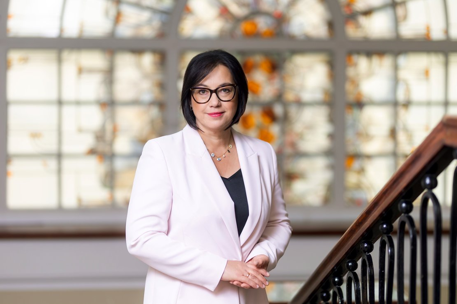
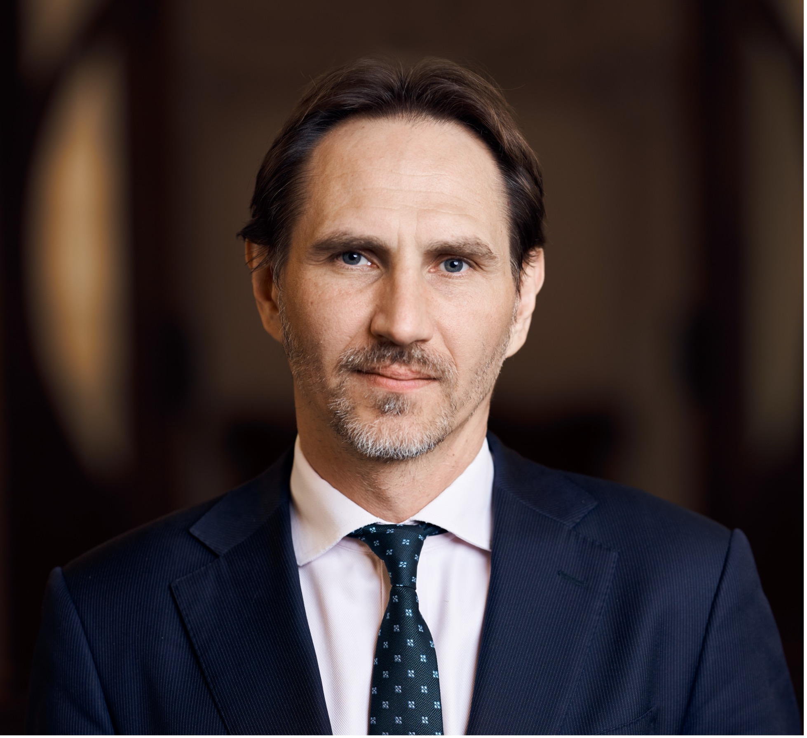
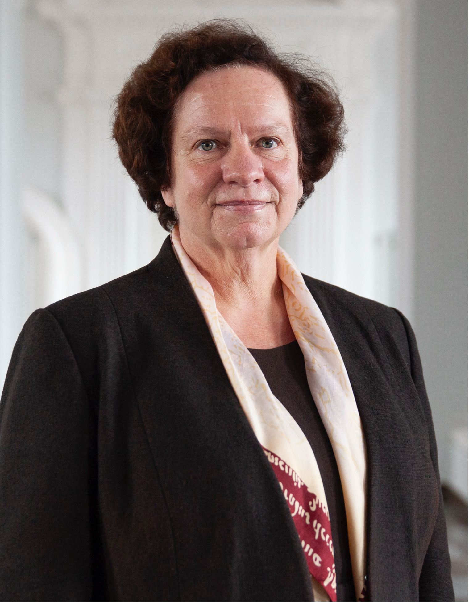
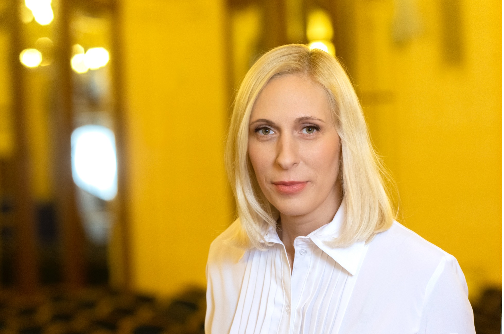
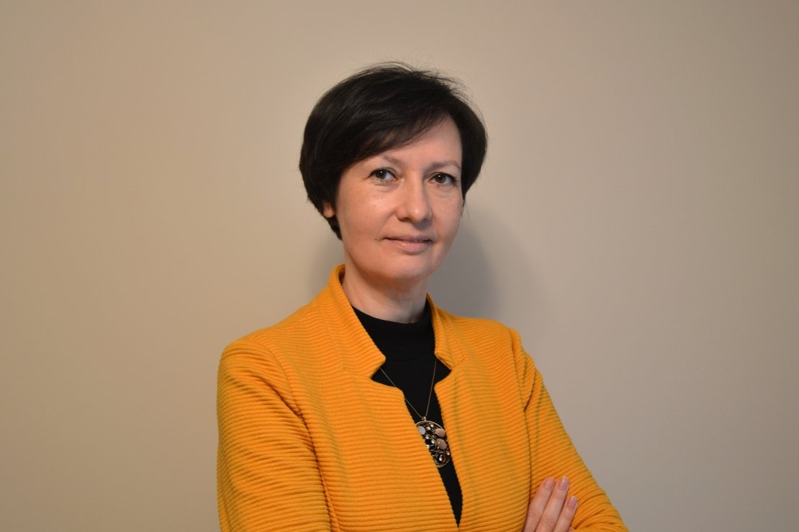
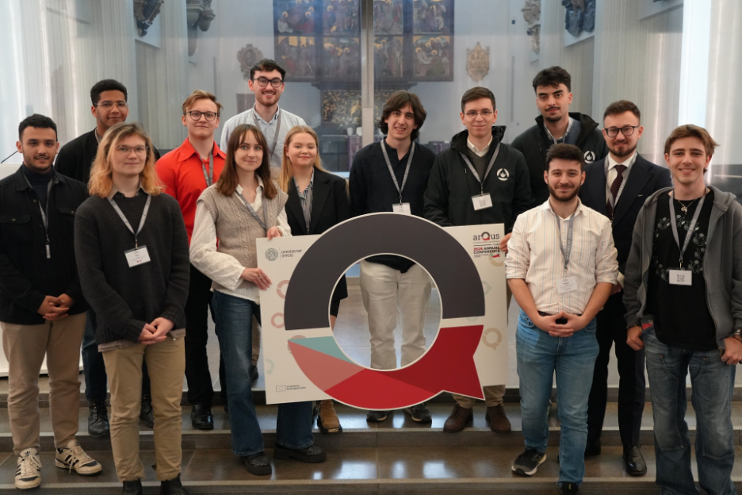

# Sveikinimai

<PhotoGrid :photos="sveikintojai" />

## Švietimo, mokslo ir sporto ministerija

<!-- SECTION:smsm:START -->

Mieli studentai,

nuoširdžiai sveikinu pasiekus puikių veiklos rezultatų!

VU SA jau ilgus metus yra aktyvus, konstruktyvus ir patikimas partneris tiek universiteto bendruomenėje, tiek nacionaliniu lygmeniu. Dėkoju už prasmingą bendradarbiavimą su Švietimo, mokslo ir sporto ministerija – kartu ieškodami geriausių sprendimų studijų kokybės, studentų gerovės ir aukštojo mokslo sistemos tobulinimo klausimais, kuriame stipresnę ir atviresnę akademinę aplinką.

Ypač vertinu Jūsų gebėjimą telkti studentų balsus, išgryninti aktualiausius poreikius ir aktyviai įsitraukti į dialogą, kuris virsta realiais pokyčiais. Tai – atsakomybės, brandos ir lyderystės ženklas.

Tegul ir toliau stiprėja bendradarbiavimas! Didžiausios sėkmės ateities darbuose!

Švietimo, mokslo ir sporto ministrė

**Raminta Popovienė**

<!-- SECTION:smsm:END -->

## LR Seimo Švietimo ir mokslo komitetas

<!-- SECTION:smk:START -->

Mieli Studentai ir Studentės, gerbiami Vilniaus universiteto Studentų atstovybės nariai,

Nuoširdžiai sveikinu Jus ataskaitinės–rinkiminės konferencijos proga.

Vilniaus universiteto studentai yra aktyvi, sąmoninga ir į pokytį orientuota visuomenės dalis. Jūsų balsas girdimas ne tik Universitete, bet ir už jo ribų – švietimo politikoje, visuomeninėse diskusijose, valdžios institucijose. Tai atspindi Universiteto siekį būti atviru, kūrybišku ir socialiai atsakingu: nuo pagalbos iniciatyvų studentams iki dėmesio akademinės etikos iššūkiams šiuolaikinių technologijų kontekste.

Ypač vertinu tai, kad Studentų atstovybė neapsiriboja tik formaliu atstovavimu – jūs nuosekliai rūpinatės studijų kokybe, ginate studentų teises, stiprinate bendruomenę, kuriate prasmingas iniciatyvas ir puoselėjate akademines vertybes. Jūsų dėka skleidžiasi tarpdalykiškumo, įtraukties, atsakomybės ir pilietiškumo idėjos.

Linkiu, kad Jūsų prasmingi darbai būtų įvertinti. Tegul išlieka stiprus studentų balsas ir gyva akademinės savivaldos dvasia, dar labiau auga tokia aktyvi ir brandi studentų bendruomenė. Sėkmės veiklose!

**Vaida Aleknavičienė**

LR Seimo Švietimo ir mokslo komiteto pirmininkė
<!-- SECTION:smk:END -->

## Vilniaus universiteto Taryba

<!-- SECTION:taryba:START -->

Vilniaus universiteto tarybos vardu dėkoju Studentų atstovybei už kryptingą ir prasmingą veiklą. Jūsų gebėjimas konstruktyviai atstovauti studentų interesams visais lygmenimis - nuo studijų kokybės iki aukštojo mokslo politikos - yra svarbi Universiteto bendruomenės stiprybės dalis. Linkiu ir toliau drąsiai, argumentuotai ir atsakingai siekti pokyčių.

**Marius Jurgilas**

Vilniaus universiteto tarybos pirmininkas
<!-- SECTION:taryba:END -->

## Vilniaus universiteto biblioteka

<!-- SECTION:biblioteka:START -->

Mielos studentės, mieli studentai,

Biblioteka ir VUSA jau daugelį metų žingsniuoja kartu — ne tik dalijasi idėjomis, bet ir kartu jas įgyvendina, kuria prasmingas iniciatyvas, stiprina bendruomeniškumą. Jūsų veržlumas ir aktyvus įsitraukimas, kritiškas mąstymas ir geranoriškas palaikymas – tai neįkainojamas indėlis, kuris kasdien padeda mums augti, tobulėti ir kurti aplinką, kurioje gera mokytis ir būti.

Džiaugiamės, kad Biblioteka Jums yra ne tik vieta darbui ar studijoms, bet ir bendrystės erdvė, kur susitinka idėjos, žmonės ir kartos. Šiemet ypatingai matome, kaip svarbu klausytis vieni kitų, ieškoti sprendimų kartu – ar tai būtų informacinio raštingumo stiprinimas, dirbtinio intelekto atveriamos galimybės ir keliami iššūkiai, Bibliotekos paslaugų prieinamumas visiems studentams ir visoms studentėms, ar tiesiog nuoširdus pokalbis apie tai, kas šiandien Jums rūpi labiausiai, kas neramina ir kas verčia svajoti.

Kiekviena Jūsų iniciatyva tampa dalimi Universiteto istorijos. Būtent Jūs praminate vis naujus takus, kuriate naujas tradicijas, paliekate pėdsaką ateities studentų kartoms. Todėl linkime neprarasti smalsumo, veržlumo ir, svarbiausia, tikėjimo savo idėjomis. Tegul VUSA veikla, naujos patirtys ir sutikti žmonės įkvepia Jus drąsiai žengti pirmyn – tiek studijose, tiek gyvenimuose.

Biblioteka yra ir visuomet išliks Jūsų namais. Čia laukiame Jūsų idėjų, klausimų, istorijų – ir tiesiog noro pabūti kartu.

**Irena Krivienė**

VU bibliotekos generalinė direktorė
<!-- SECTION:biblioteka:END -->

## Akademinės etikos ir procedūrų kontrolierė

<!-- SECTION:aekpk:START -->

Vertiname Jūsų atvirumą, iniciatyvumą ir gebėjimą ne tik kelti svarbius klausimus, bet ir ieškoti vertingų sprendimų. Kiekviena bendra idėja ir iniciatyva padeda mums geriau suprasti studentų poreikius bei kurti akademinę kultūrą, grindžiamą pagarba, pasitikėjimu ir atsakomybe. Esame dėkingi už prasmingą partnerystę ir džiaugiamės tęsdami bendras veiklas, kurios prisideda prie dar stipresnio studentų balso akademinėje etikoje.

**Dr. Reda Cimmperman**

Akademinės etikos ir procedūrų kontrolierė
<!-- SECTION:aekpk:END -->

## Studijų kokybės vertinimo centras

<!-- SECTION:skvc:START -->

Studijų kokybės vertinimo centre su džiaugsmu žvelgiame į dar vienerius prasmingus ir įkvepiančius bendradarbiavimo metus su Vilniaus universiteto studentų atstovybe. Nuoširdžiai vertiname jūsų atsidavimą, naujas idėjas ir aktyvų įsitraukimą kuriant studentų poreikius atliepiančią aukštojo mokslo sistemą. Jūsų balsas yra svarbus – ir jis daro pokytį. Tvirtai tikime, kad tęsdami bendrą darbą atversime studentams daugiau mokymosi, karjeros ir asmeninio tobulėjimo galimybių.

**Zinaida Manžuch** 

SKVC direktoriaus atstovė
<!-- SECTION:skvc:END -->

## Arqus studentų (-čių) taryba

<!-- SECTION:arqus:START -->

Dėkojame Vilniaus universiteto Studentų atstovybei, kurios nuoseklus dalyvavimas ir atsidavimas Arqus Studentų atstovybės veikloje padėjo surengti produktyvias diskusijas su įvairiais Arqus aljanso universitetų akademinio ir neakademinio personalo atstovais (-ėmis) tokiomis temomis kaip Europos laipsnis ir aljanso struktūra.  

Dėkojame, kad dalijatės savo idėjomis ir požiūriais, kaip jūs ir jūsų studentų (-čių) atstovybė kuriate sisteminius pokyčius savo universitete ir šalyje. 

<!-- SECTION:arqus:END -->
