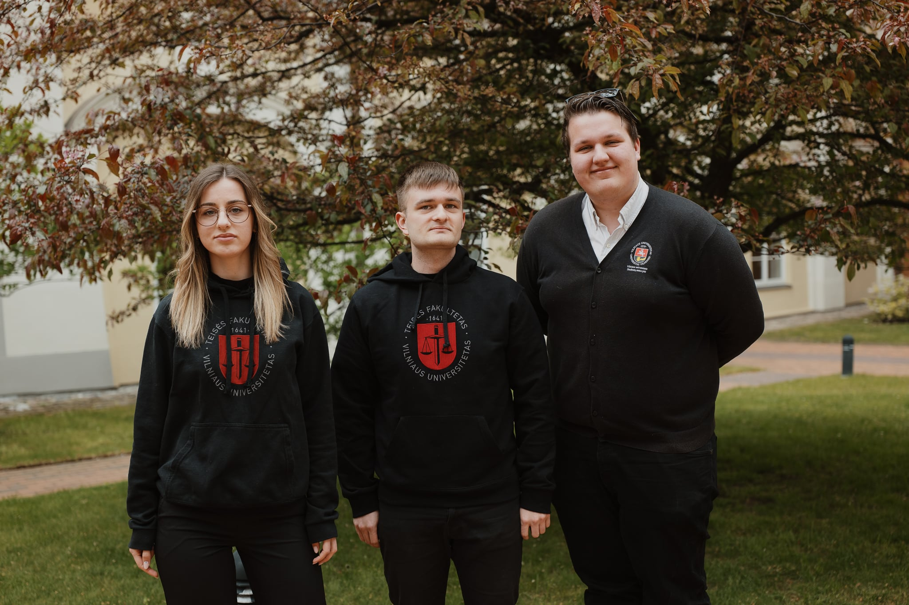

# Duomenų apsaugos grupė (DAG)

{.rounded-sm}

<!-- ::: tip ☑️ Ką nuveikėme? -->
<!---->
<!-- - Atnaujintas ir aktualizuotas VU SA Asmens duomenų tvarkymo tvarkos aprašas bei parengti siūlymai jam tobulinti. -->
<!-- - Parengtas asmens duomenų incidentų valdymo ir reagavimo planas. -->
<!-- - Užtikrintas padalinių atstovų, dirbančių su asmens duomenimis, įsipareigojimų surinkimas ir žinių testavimas. -->
<!---->
<!-- ::: -->

::: details 2024–2025 m. Duomenų apsaugos grupę sudarė...

<TeamAvatarLayout :members="dag" :showTitle="true" :showPadalinys="false" />

:::

2024–2025 m. grupė veikė pagal praeitais metais atliktą VU SA duomenų apsaugos rizikos vertinimą ir peržvelgė VU SA Asmens duomenų tvarkymo Vilniaus universiteto Studentų atstovybėje tvarkos aprašą bei nusprendė pateikti siūlymus jį atnaujinti, aktualizuoti. Taip pat sukurtas incidentų valdymo ir reagavimo planas. Pristatėme savo veiklą VU SA Tarybai. Ataskaitiniu laikotarpiu buvo įvykdytas Įsipareigojimų saugoti asmens duomenų paslaptį surinkimas iš VU SA narių, kurie buvo paskirti savo padalinių asmenimis, atsakingais už asmens duomenų apsaugą. Taip pat buvo atliktas minėtų asmenų testavimas asmens duomenų apsaugos tematika naudojantis VMA aplinka. 

Esant poreikiui peržiūrėdavome VU SA sudaromas sutartis bei siūlydavome atsisakyti perteklinių asmens duomenų rinkimo, jeigu tokie buvo renkami. Sukūrėme VU SA apklausų, kuriose registruojami asmens duomenys, registrą. Ataskaitiniu laikotarpiu įvyko 4 gyvi susitikimai bei nuotolinis pokalbis, veikla buvo nuolat derinama bendrame susirašinėjime tarp narių ir Prezidentės. Baigiantis ataskaitiniam laikotarpiui buvo sudėlioti ateities darbai. 
