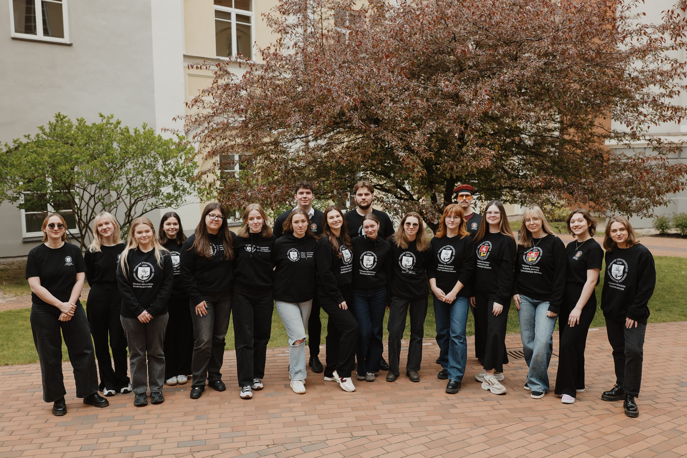

# VU SA Parlamentas

{.rounded-sm}

::: tip 📖 VU SA Parlamentas – tai...
VU SA valdymo organas, svarstantis svarbiausius
socialinius ir akademinius, su studentais (-ėmis) susijusius ar kitus VU
SA strateginius klausimus.

VU SA Parlamentą sudaro:

- organizacijos prezidentas
- viceprezidentas
- atstovavimo funkciją vykdančių VU SA
padalinių pirmininkai (-ės) ir po du atstovus (-es) iš kiekvieno
padalinio.

VU SA Parlamento darbą organizuoja pirmininkas.
:::

VU SA Parlamentui pirmininkavo Gabrielė Kasperaitė.

::: details 2024-2025 m. VU SA Parlamentą sudarė:

- VU SA Prezidentė Klėja Merčaitytė
- **VU SA CHGF:** Eglė Lukauskaitė, Agnė Dirmantaitė, Laurynas Cicėnas
- **VU SA EVAF:** Ieva Gruodytė (iki sausio mėn.), Karina Kandrotaitė (nuo sausio mėn.), Miglė Gutauskaitė, Loreta Stefanovič
- **VU SA FF:** Tadas Lekšas, Teresė Kreišmontaitė, Vytautė Kubaitytė
- **VU SA FilF:** Eglė Gaučaitė, Justė Pečkaitytė, Rasa Valentinavičiūtė
- **VU SA FsF:** Jūra Subačiūtė, Samanta Valiušaitytė, Albertas Apanavičius
- **VU SA GMC:** Viktorija Amankevičiūtė, Uršulė Barkauskaitė, Justinas Kavoliūnas
- **VU SA IF:** Smiltė Urbonaitė, Justinas Čovbanas, Simonas Voroblievas
- **VU SA KnF:** Austėja Simonaitytė, Kamilė Krivičiūtė, Silvija Markauskaitė
- **VU SA KF:** Lukrecija Kociūtė, Karina Vaičekauskaitė, Emilija Lopaitytė
- **VU SA MF:** Lurdes Gaidelytė, Roberta Kirkliauskaitė, Maria Gaskin
- **VU SA MIF:** Vygintas Bartusevičius, Ugnė Baublytė (iki sausio mėn.), Gabrielė Kasperaitė
- **VU SA ŠA:** Austė Vilkonytė, Akvilė Jonaitytė, Gustė Gruzdaitė-Lionikė (iki rugsėjo mėn.)
- **VU SA TF:** Andrius Viljamas Gontier, Viktorija Jonuškaitė, Martyna Gedrimaitė
- **VU SA TSPMI:** Deivydas Mickus (iki rugpjūčio mėn.), Matas Ruškevičius (nuo rugpjūčio mėn.), Urtė Palevičiūtė (iki rugsėjo mėn.), Oona Adeline Shaw (nuo gruodžio mėn.), Gytis Oškelis
- **VU SA VM:** Sofija Kavaliauskaitė (iki gruodžio mėn.), Edvinas Paulaitis, Martynas Katilauskas, Matas Balinš (nuo gruodžio mėn.)

:::

Ataskaitiniu laikotarpiu įvyko 7 Parlamento posėdžiai, 1 atviras
Parlamento posėdis, 1 el. balsavimas ir 2 darbo sesijos.

## Pasiūlymai aukštojo mokslo politikos įgyvendinimui Lietuvoje

Reaguodamas į artėjančius LR Seimo rinkimus, VU SA Parlamentas
patvirtino dar praėjusioje kadencijoje pradėtus rengti siūlymus,
atspindinčius tiek studentų (-čių) poreikius, tiek bendrą visuomenės
interesą gerinti aukštojo mokslo situaciją šalyje.\
Pasiūlymuose išskirtos 6 prioritetinės sritys: socialinė dimensija
aukštajame moksle, užsieniečių studentų (-čių) integracija,
doktorantūros studijų stiprinimas ir doktorantų (-čių) sąlygų gerinimas,
studentų (-čių) mokslinės veiklos skatinimas, atliekamos praktikos
apmokėjimas bei tvarumas studijose ir jų aplinkoje. [Skaityti
plačiau.](https://vustudentuatstovybe.sharepoint.com/sites/vieningai/Bendrai%20naudojami%20dokumentai/Forms/AllItems.aspx?id=%2Fsites%2Fvieningai%2FBendrai%20naudojami%20dokumentai%2FArchyvas%2F1%2E%20Visiems%20%28LT%20%26%20EN%29%20%E2%86%92%20For%20All%20%28LT%20%26%20EN%29%2F04%2E%20Nutarimai%20%E2%86%92%20Resolution%2FVU%20SA%20Parlamentas%20%E2%86%92%20VU%20SR%20Parliament%2FLT%2F2024%2D2025%2F2024%2D06%2D05%2F2024%2D06%2D05%20PPN%2D24%2D5%2D1%20Parlamento%20nutarimas%20d%C4%97l%20Vilniaus%20universiteto%20Student%C5%B3%20atstovyb%C4%97s%20pasi%C5%ABlym%C5%B3%20auk%C5%A1tojo%20mokslo%20politikos%20%C4%AFgyvendinimui%20Lietuvoje%20tvirtinimo%2Epdf&parent=%2Fsites%2Fvieningai%2FBendrai%20naudojami%20dokumentai%2FArchyvas%2F1%2E%20Visiems%20%28LT%20%26%20EN%29%20%E2%86%92%20For%20All%20%28LT%20%26%20EN%29%2F04%2E%20Nutarimai%20%E2%86%92%20Resolution%2FVU%20SA%20Parlamentas%20%E2%86%92%20VU%20SR%20Parliament%2FLT%2F2024%2D2025%2F2024%2D06%2D05&p=true&ga=1)

## Pozicija dėl VU KAP skatinimo tvarkų dėstytojams (-oms) už mokslinę veiklą ir studentų (-čių) įtraukimą į ją

Pozicijoje atkreipiamas dėmesys į studentų (-čių) įtraukimą į mokslines
veiklas ir siūloma į VU KAP skatinimo tvarkas dėstytojams (-oms)
įtraukti skatinimą už įsitraukimą į studentų (-čių) mokslinių draugijų
ar kitą studentų (-čių) mokslinę saviraišką skatinančių priemonių
veiklą, pirmosios ir antrosios pakopos studentų (-čių) įtraukimą į
mokslinius projektus, bendrus tyrimus ir jų publikavimą. [Skaityti
plačiau](https://vustudentuatstovybe.sharepoint.com/sites/vieningai/Bendrai%20naudojami%20dokumentai/Forms/AllItems.aspx?id=%2Fsites%2Fvieningai%2FBendrai%20naudojami%20dokumentai%2FArchyvas%2F1%2E%20Visiems%20%28LT%20%26%20EN%29%20%E2%86%92%20For%20All%20%28LT%20%26%20EN%29%2F04%2E%20Nutarimai%20%E2%86%92%20Resolution%2FVU%20SA%20Parlamentas%20%E2%86%92%20VU%20SR%20Parliament%2FLT%2F2024%2D2025%2F2024%2D10%2D23%2F2024%2D10%2D23%20PPN%2D24%2D7%2D1%20Parlamento%20nutarimas%20d%C4%97l%20pozicijos%20d%C4%97l%20VU%20SA%20pasi%C5%ABlym%C5%B3%20VU%20KAP%20skatinimo%20tvark%C5%B3%20d%C4%97stytojams%20%28%2Doms%29%20u%C5%BE%20mokslin%C4%99%20veikl%C4%85%20ir%20student%C5%B3%20%28%2D%C4%8Di%C5%B3%29%2Epdf&parent=%2Fsites%2Fvieningai%2FBendrai%20naudojami%20dokumentai%2FArchyvas%2F1%2E%20Visiems%20%28LT%20%26%20EN%29%20%E2%86%92%20For%20All%20%28LT%20%26%20EN%29%2F04%2E%20Nutarimai%20%E2%86%92%20Resolution%2FVU%20SA%20Parlamentas%20%E2%86%92%20VU%20SR%20Parliament%2FLT%2F2024%2D2025%2F2024%2D10%2D23&p=true&ga=1).

## Atviras VU SA Parlamento posėdis

Tradiciškai, šis posėdis buvo skirtas susipažinimui su kandidatu į VU
Rektorius -- prof. dr. Rimvydu Petrausku bei jo veiklos programa,
užduoti staudentams (-ėms) rūpimus klausimus. Prisistatymo metu
kandidatas pasirašė 11 punktų pasižadėjimą Vilniaus universiteto
studentams (-ėms), kuriuos išrinkimo atveju žada įgyvendinti per
ateinančius penkerius metus. [Skaityti
plačiau.](https://www.vusa.lt/lt/naujiena/kandidato-i-vu-rektorius-pristatymas?fbclid=IwY2xjawKQXddleHRuA2FlbQIxMABicmlkETFta2tkdmVaYjJtSkFYNFBGAR6iEQCpIS4vl_Q3W-aDVrbV_NWbE7w7G9_Bf_lulTamH1ybN-1zDzOc6ck9YA_aem_0Tisw7hR9AR2igzVOigNJQ)

## VU SA studentų iniciatyvų finansavimo nuostatai

Nuostatuose nustatyta tvarka, kaip VU studentai (-ės) galės teikti
paraiškas savo idėjų ir projektų finansavimui gauti, kokiais principais
vadovaujamasi skirstant lėšas, kokie reikalavimai keliami iniciatyvoms
ir kaip vyksta jų vertinimas bei atsiskaitymas. (Tikslas -- skatinti
aktyvų studentų (-čių) dalyvavimą kuriant universiteto bendruomenei
naudingas veiklas.) [Skaityti
plačiau.](https://vustudentuatstovybe.sharepoint.com/sites/vieningai/Bendrai%20naudojami%20dokumentai/Forms/AllItems.aspx?id=%2Fsites%2Fvieningai%2FBendrai%20naudojami%20dokumentai%2FArchyvas%2F1%2E%20Visiems%20%28LT%20%26%20EN%29%20%E2%86%92%20For%20All%20%28LT%20%26%20EN%29%2F04%2E%20Nutarimai%20%E2%86%92%20Resolution%2FVU%20SA%20Parlamentas%20%E2%86%92%20VU%20SR%20Parliament%2FLT%2F2024%2D2025%2F2024%2D12%2D18%2F2024%2D12%2D18%20PPN%2D24%2D9%2D1%2C%20Parlamento%20nutarimas%20d%C4%97l%20Vilniaus%20universiteto%20Student%C5%B3%20atstovyb%C4%97s%20student%C5%B3%20iniciatyv%C5%B3%20finansavimo%20nuostat%C5%B3%20tvirtinimo%2Epdf&parent=%2Fsites%2Fvieningai%2FBendrai%20naudojami%20dokumentai%2FArchyvas%2F1%2E%20Visiems%20%28LT%20%26%20EN%29%20%E2%86%92%20For%20All%20%28LT%20%26%20EN%29%2F04%2E%20Nutarimai%20%E2%86%92%20Resolution%2FVU%20SA%20Parlamentas%20%E2%86%92%20VU%20SR%20Parliament%2FLT%2F2024%2D2025%2F2024%2D12%2D18&p=true&ga=1)

## Rezoliucija dėl VU vaidmens ugdant bendruomenės sąmoningumą ir atsparumą nacionalinio saugumo grėsmėms

Atsižvelgdamas į šių dienų iššūkius, VU SA Parlamentas patvirtino
rezoliuciją, kurioje pabrėžiamas VU vaidmuo ugdant kritinį mąstymą,
informacinį raštingumą ir pilietinį sąmoningumą. Taip pat skatinama
Universitetą imtis proaktyvių veiksmų ugdant bendruomnenės narių
pilietinio pasipriešinimo įgūdžius įtraukiant šias temas į studijų
turinį ir kitas bendruomenės veiklas. [Skaityti
plačiau.](https://vustudentuatstovybe.sharepoint.com/sites/vieningai/Bendrai%20naudojami%20dokumentai/Forms/AllItems.aspx?id=%2Fsites%2Fvieningai%2FBendrai%20naudojami%20dokumentai%2FArchyvas%2F1%2E%20Visiems%20%28LT%20%26%20EN%29%20%E2%86%92%20For%20All%20%28LT%20%26%20EN%29%2F04%2E%20Nutarimai%20%E2%86%92%20Resolution%2FVU%20SA%20Parlamentas%20%E2%86%92%20VU%20SR%20Parliament%2FLT%2F2024%2D2025%2F2025%2D04%2D09%2F2025%2D04%2D09%20PPN%2D25%2D2%2D1%2C%20Parlamento%20nutarimas%20d%C4%97l%20rezoliucijos%20d%C4%97l%20Vilniaus%20universiteto%20vaidmens%20ugdant%20bendruomen%C4%97s%20s%C4%85moningum%C4%85%20ir%20atsparum%C4%85%20nacionalinio%20saugumo%20gr%C4%97sm%C4%97ms%20tvirtinimo%2Epdf&parent=%2Fsites%2Fvieningai%2FBendrai%20naudojami%20dokumentai%2FArchyvas%2F1%2E%20Visiems%20%28LT%20%26%20EN%29%20%E2%86%92%20For%20All%20%28LT%20%26%20EN%29%2F04%2E%20Nutarimai%20%E2%86%92%20Resolution%2FVU%20SA%20Parlamentas%20%E2%86%92%20VU%20SR%20Parliament%2FLT%2F2024%2D2025%2F2025%2D04%2D09&p=true&ga=1)

## VU SA 2025--2028 m.m. strateginis veiklos planas

Plane išskirtos pagrindinės VU SA veiklos kryptys ir jų projektai, kurių
pagrindu bus grindžiama VU SA veikla 2025-2028 m.m. Kokybiškų studijų ir
joms pritaikytos aplinkos kryptis prioritetas - personalizuotų studijų
sąlygų sudarymas, stiprios organizacijos - efektyvūs organizacijos
veiklos procesai, darnios universitetinės bendruomenės - vieninga ir
iniciatyvi bendruomenė bei darnus universitetas. [Skaityti
plačiau.](https://vustudentuatstovybe.sharepoint.com/sites/vieningai/Bendrai%20naudojami%20dokumentai/Forms/AllItems.aspx?id=%2Fsites%2Fvieningai%2FBendrai%20naudojami%20dokumentai%2FArchyvas%2F1%2E%20Visiems%20%28LT%20%26%20EN%29%20%E2%86%92%20For%20All%20%28LT%20%26%20EN%29%2F04%2E%20Nutarimai%20%E2%86%92%20Resolution%2FVU%20SA%20Parlamentas%20%E2%86%92%20VU%20SR%20Parliament%2FLT%2F2024%2D2025%2F2025%2D04%2D16%2F2025%2D04%2D16%20PPN%2D25%2D3%2D1%2C%20Nutarimas%20d%C4%97l%20Vilniaus%20universiteto%20Student%C5%B3%20atstovyb%C4%97s%20veiklos%20plano%202025%2D2028%20metams%20tvirtinimo%2Epdf&parent=%2Fsites%2Fvieningai%2FBendrai%20naudojami%20dokumentai%2FArchyvas%2F1%2E%20Visiems%20%28LT%20%26%20EN%29%20%E2%86%92%20For%20All%20%28LT%20%26%20EN%29%2F04%2E%20Nutarimai%20%E2%86%92%20Resolution%2FVU%20SA%20Parlamentas%20%E2%86%92%20VU%20SR%20Parliament%2FLT%2F2024%2D2025%2F2025%2D04%2D16&p=true&ga=1)

## Patvirtintas (ir VU SA ARK teikiamas) VU SA Įstatų pakeitimo projektas

VU SA Parlamento kadencijos pradžioje suburta nuolatinė darbo grupė dėl
VU SA veiklą reglamentuojančių dokumentų atnaujinimo. Proceso metu --
peržvelgti ir atnaujinti VU SA Įstatai, Darbo reglamentas ir pavyzdiniai
VU SA padalinių, vykdančių atstovavimo funkciją, nuostatai. Paskutiniojo
posėdžio metu nuspręsta VU SA Įstatų pakeitimo projektą tvirtinimui
teikti VU SA ataskaitinei-rinkiminei konferencijai (ARK). [Skaityti
plačiau.](https://vustudentuatstovybe.sharepoint.com/sites/vieningai/Bendrai%20naudojami%20dokumentai/Forms/AllItems.aspx?id=%2Fsites%2Fvieningai%2FBendrai%20naudojami%20dokumentai%2FArchyvas%2F1%2E%20Visiems%20%28LT%20%26%20EN%29%20%E2%86%92%20For%20All%20%28LT%20%26%20EN%29%2F04%2E%20Nutarimai%20%E2%86%92%20Resolution%2FVU%20SA%20Parlamentas%20%E2%86%92%20VU%20SR%20Parliament%2FLT%2F2024%2D2025%2F2025%2D04%2D16%2F2025%2D04%2D16%20PPN%2D25%2D3%2D2%2C%20Nutarimas%20d%C4%97l%20Vilniaus%20universiteto%20Student%C5%B3%20atstovyb%C4%97s%20%C4%AFstat%C5%B3%20projekto%20teikimo%20Vilniaus%20universiteto%20Student%C5%B3%20atstovyb%C4%97s%20ataskaitinei%2Drinkiminei%20konferencijai%2Epdf&parent=%2Fsites%2Fvieningai%2FBendrai%20naudojami%20dokumentai%2FArchyvas%2F1%2E%20Visiems%20%28LT%20%26%20EN%29%20%E2%86%92%20For%20All%20%28LT%20%26%20EN%29%2F04%2E%20Nutarimai%20%E2%86%92%20Resolution%2FVU%20SA%20Parlamentas%20%E2%86%92%20VU%20SR%20Parliament%2FLT%2F2024%2D2025%2F2025%2D04%2D16&p=true&ga=1)

Kiti:

- Parengtos atnaujintų VU SA Darbo reglamento ir pavyzdinių VU SA
  padalinių, vykdančių atstovavimo funkciją, nuostatų redakcijos
- Išrinkti studentų atstovai (-ės) į Vilniaus universiteto Senatą
- Išrinktas studentų atstovas į Vilniaus universiteto Tarybą
- Patvirtintas VU SA 2024-2025 m. m. veiklos planas
- Patvirtintas VU SA 2025 m. biudžetas
