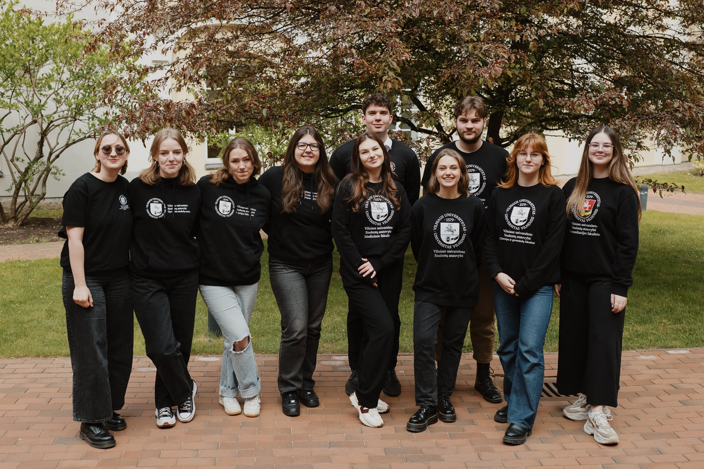

# VU SA Taryba

{.rounded-sm}

::: tip **VU SA Taryba** – tai...
VU SA valdymo organas, sprendžiantis
bendradarbiavimo ir organizacijos vidaus klausimus. Šį valdymo organą
sudaro atstovavimo funkciją vykdančių Organizacijos padalinių vadovai
(pirmininkai) ir prezidentas, kuris organizuoja šio valdymo organo
veiklą.
:::

::: details 2024–2025 m. VU SA Tarybą sudarė...

<TeamAvatarLayout :members="taryba" :showTitle="false" :showPadalinys="true" />

:::

Ataskaitiniu laikotarpiu vyko 19 VU SA Tarybos posėdžių, iš kurių 11 buvo elektroniniai.  

VU SA Taryba 2024-2025 m. svarstė ir / arba priėmė šiuos sprendimus:  

- Patvirtino VU SA Institucinio stiprinimo fondo sudėtį; 
- Patvirtino pagrindinių renginių, kurių išlaidos viršija 3 tūkst. eurų, sąmatas; 
- Svarstė 2025 m. biudžeto planavimą bei atnaujintą veiklos planavimo procesą; 
- Sudarė darbo grupes dėl narystės testo ir bendrųjų kompetencijų užskaitymo atnaujinimo; 
- Pritarė Vilniaus universiteto Investicinio studentų fondo narystei Vilniaus jaunimo organizacijų sąjungoje „Apskritasis stalas“; 
- Pritarė CO2 pėdsako skaičiavimo proceso pokyčiams; 
- Patvirtino VU SA Ataskaitinės–rinkiminės konferencijos datą; 
- kūrė VU SA strateginį veiklos planą 2025-2028 metams. 

